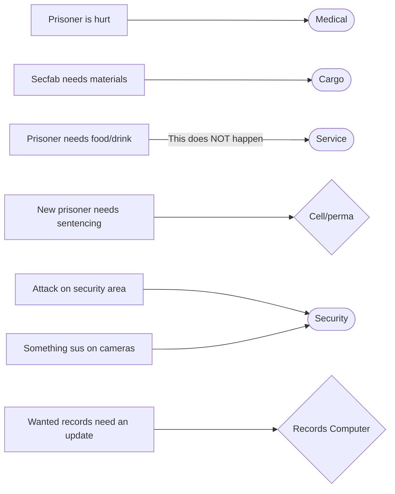

# Warden improvements

| Designers | Implemented | GitHub Links |
|---|---|---|
| Killerqu00 | :x: No | TBD |

## Overview

Warden currently has the worst gameplay: you are actively punished for leaving your department (which often has no roleplay opportunities), effectively making the role very boring and half-AFK.

## Background

Let's read Warden's role description:
```admonish quote
Patrol the security department, ensure that no one is stealing from the armory, and make sure that all prisoners are processed and let out when their time is up.
```
As we can see, Warden's *intended* gameplay is to sit in an access-locked department alone 90% of the time and wait until something happens. Now let's read the design principles:
```admonish quote
Mechanics which incentivize players to do them entirely alone (...) will very likely not be added to SS14.
```
Warden's role is designed in a way that contradicts one of the most important rules of SS14 design. This is bad.

## _transformSystem.Unanchor(warden)

Warden needs more interactions with other departments, which should encourage warden to sometimes leave their nest or at least give them more things to do while guarding security.
Here are some problems that a warden can encounter:

Out of these problems, only 2 actually require interactions outside of security - healing prisoners and getting materials.
I'll cover each of these interactions and how to improve them.

## Prisoners must be granted adequate medical care
Healing prisoners is often done by security officers, since they are mobile and can actually escort a prisoner to medical and back. Instead, I suggest something a few maps have: a common area available both to security and medical. I'll refer to it as "Infirmary Wing".


The intended way the interaction with medical will go is like this:
- Warden calls a doctor to the infirmary wing;
- Warden escorts a hurt prisoner to infirmary;
- Doctor arrives and heals the prisoner;
- Warden escorts the prisoner back into the cell/perma.

## :s Come to sec and get disabler SMG
Interaction with cargo is mostly good already, but there is something to add here. A lot of crates in cargo contain security gear - it would be best to make it a little bit more difficult to order those by placing a "Cargo Monitoring Console" in warden's office. All security gear orders from cargo have to get an additional approval via this console. This can also be disabled at the same console in case of an emergency (nukies/dragon).

## Food and drink for prisoners
Prisoners have right to food and drink per space law, but this is difficult to provide as of now: in order to give prisoner something, you need to open the cell, which forces you to use a flash if the prisoner wants to escape.

A solution to this is a special cell door with a container slot - you will be able to insert items into the door, and the prisoner can get them out of the door. If meal trays ever get added, maybe it'd make sense to map some near the cells.

## Vandalism, secure tresspass and possession of contraband
The process of sentencing itself is mostly fine, however, Space Law is mostly heavily outdated and poorly written. This is out of scope of this proposal, though.

## ;NUKIES ARMORY
Armory defense is quite a hot topic. Reinforced walls are quite easy to breach, meaning that a single person with 1-2 charges of C4 can easily get access to armory in 10-15 seconds, meaning that warden spending any time outside hearing range of armory potentially endangers security.

This can be solved by a few measures, for example:
- The next tier of reinforced wall that is harder than reinforced. Should be difficult to produce manually.
- Movement sensors that detect anyone in an area without proper access and play a loud sound.

## Constant camera monitoring
This is more of a symptom of warden having nothing to do inside security; I don't think this needs a fix, as long as other measures work.

## Criminal records
Warden often acts as a way to remotely update criminal records, which serves no purpose except being a tedium simulator for warden.
Record status should be updateable remotely by all security members, but with a few changes to the interface:
- Remote Records do not show anything except from name, job and current status. For DNA/fingerprints access, you still need a stationary computer.
- Crime history also cannot be updated remotely.
- It should not be possible to change the "Detained" status of a person remotely, forcing warden to actually work with records while handling prisoners.