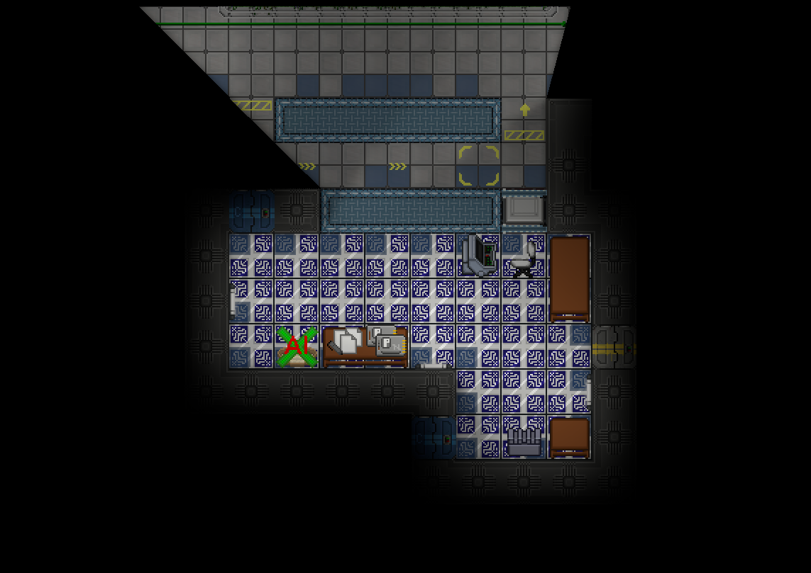

# PR Guildlines

```admonish warning
This is an old page, and hasn't been updated in over a year. It does not reflect the current state of the game and should be updated as soon as possible.
The page will be updated by the mapping work group soon (tm).

Until then, consult other mappers, people with the "Head Mapper" role, and the #cartography discord channel as for what content should be present in your map. **This should not be your sole source of information.**
```


# Mapping sins
=======
Don't do any of these. They make for bad looking/feeling maps.

## Ultra-wide hallways
So the thing about hallways is that they're empty.

This looks and feels bad to play in, with a very large amount of blank space visually.

### Ways to fix

#### Convert to a parkway
Filling the visual emptiness with plantlife or other decoratives helps significantly. This shouldn't be overdone, though, and it's preferrable to simply use smaller hallways.


## Abdundance of silver/gold tiles
To put it simply they look terrible, especially combined with decals, and should be used only in extremely specific situations.


### Ways to fix

#### Just change the theme
If you're using them to line a "rich feeling" room, say, the HoP's office, opt for instead focusing on a home-y feeling, with woods/etc. Most of the station simply does not have this feel and it'll make them seem exceptional.


# Mapping Checklist
===========

This checklist is a general guide on what items are required for typical SS14 station maps. Small maps and non-standard maps may not be able to fit all the content specified, so use this as general guidelines only.

When necessary, the entity ID will be in brackets if it differs greatly from the name of the item. In most cases, you can just search the name. Names with suffixes such as `[filled]` indicate a variant of an entity.

## Blacklist
The items in the following list should not be placed on maps under any circumstances. Unless you are 100% certain that the item is necessary for your map, do not place it, even if it's in a "hidden" location.

If you do choose to add one of these items, seek permission from a maintainer or the head mapper and specifically mention it in your PR.

- Nuclear Authentication Disk
- Nuclear Authentication Codes
- Items with the `[DEBUG]` suffix
- Items with the `[ADMIN]` suffix
- DAW (Digital Audio Workstation)
- Supersynth
- Dual Port Vents (at your own risk, colouring is a pain and they might not work)
- Traitor uplink items
- Tier 2 and Tier 3 research unlocks
- Romerol, in any form

### Item Checklist
Broken down by department and then by individual area, this contains what items should be mapped and what items can optionally be added. Like the rest of this checklist, this is merely guidelines, not written and stone, and does not apply to non-standard maps.

## Command
#### Bridge
Required
- Communications Console
- ID Card Computer
- Station Records Computer

Optional
- Fireaxe
- Recharger
- Power Monitoring Computer
- Crew Monitor
- First Aid Kits + Fire & Emergency Locker
- Filing Cabinets / Drawers
- Camera [command]
- Camera Monitor

#### Vault
Required
- Nuke
- Gold Bars (a single stack)

Optional
- Credits (Not excessive, 10k maybe, cargo will want to steal this)
- Camera Router [command] (if no tcoms room)
- Premium Cigars

#### Captain’s Quarters
Required
- Captain’s Locker [filled]
- Captain’s Spare ID
- Renault Spawner (and dog bed)

Optional
- ID Card Computer
- Communications Console (spare)
- Extra drip / Captains Items / Oxygen Tank for hardsuit.
- Bed + Captains Bedsheet
- A bathroom / shower room (with duck and soap)
- Fireplace / TV

#### Head of Personnel’s Office
Required
- ID Card Computer
- Head of Personnel locker [filled]
- Uniform Printer (place durathread and cloth too)
- Ian Spawner (and dog bed)
- PTech Vending Machine

Optional  
- Bed + HoP bedshet#et
- Hand Labeller
- Crew Monitor
- Personnel Crate
- Filing Cabinet / Drawers
- Fireplace / TV

## Security
#### Brig (Main Area)

Required
- Use Airlock [Brig, Locked] doors to separate the lobby from the general secure area. Lawyers and HoP have access to these doors.
- Jail Cells (feel free to use Security access secure windoors here so Lawyer can’t free people). Use Prisoner Wardrobe [filled].
- Security Officer Lockers [filled]
- SecTech Vending Machine
- Handcuff Boxes / Ziptie Boxes
- Brig Timers

Optional
- Interrogation Room
- Evidence Room (with evidence lockers / closets, body bags and boxes)
- Break Room (microwave, donk pocket spawner, sink, table, vendors etc)
- Security Drobe
- Extra disablers & Stun Batons
- Wall Chargers and Rechargers
- Flashes (portable and entity)
- Security Barriers
- Water Cooler
- Secway Spawner + Keys

### Wardens Office
Required
- Warden’s Locker [filled]
- Criminal Records Computer
- Station Records Computer

Optional
- Extra Charger and Batons
- Filing Cabinets / Drawers
- A button for securing any blast doors
- First Aid Kit
- Camera Monitor / Telescreen
- McGriff Spawner

#### Head of Security’s Room
Required
- Head of Security Locker [filled]

Optional
- Bed + HoS Bedsheets
- Shiva Spawner
- Telescreen / Camera Monitor
- Button for security lethal armory
- WT550

#### Armory
Required
- Guns (lethal and non lethal, see above) Use NT Lore friendly weapons, nothing crazy.
- Security TechFab
- Security Hardsuits

Optional
- EOD Suit Closet [filled]
- Bulletproof Vests / Armor
- Flashbang box
- Ammo boxes lethal and non lethal
- Tech Fab Materials
- Extra Security Barriers
- Extra Handcuffs
- Another SecTech Vending Machine

#### Perma Brig
Required
- sustainable food system (hydro trays, fruit seeds, seed extractor, mini hoe , water source, buckets or cups)
- Sustenance Vendor
- Beds

Optional
- arcade machines/instruments for boredom
- Emergency or Prisoner EVA suits locked up
- Hide a tool in a plant pot or toilet.

#### Detective’s Room
Required
- Detective’s Cabinet
- Station records computer

Optional
- DetDrobe
- Detective Items like cigarettes, lighters, hats, folders etc
- Filing Cabinets / Drawers
- Water Cooler

#### Courtroom
Required
- Defence and Prosecution Tables
- Judges seat & table
- Witness Stand
- Accused Stand

Optional
- Audience Seats
- Jury Stand
- court settlement vault
- Plants, Water cooler, Decoration

#### Law Office
Optional
- lawdrobe
- papers and folders
- other roleplay friendly items
- Desks with seating for lawyer and client

## Medical
#### Medbay
Required
- See Individual Rooms
- Medical Techfab
- Patient seating/bedding
- Medkits
- Nanomed Machine
- Medidrobe
- Reception Area with Seating
- medical supplies locker

Optional
- Rollerbeds
- Paramedic Job and Locker
- crew monitor
- Medical Records Console
- Medical lockers
- Medical doctor lockers

#### Chemistry
Required
- chem dispenser and chem master
- chem vend
- grinder
- chemical locker
- hotplate

Optional
- extra beaker boxes
- hand labeller
- plasma
- syringe boxes
- pill boxes
- Drain

#### Virology
Required
- disease diagnoser delta extreme machine
- vaccinator machine
- mouth swab box
- sterile mask box
- latex gloves box

Optional
- nitrile gloves (these are better than latex, use sparingly)
- level 3 biohazard closet
- isolated ward
- virodrobe

#### Chief Medical Officer’s Room
Required
- CMO Locker [filled]

Optional
- bed/cmo bedsheet
- crew monitor console
- medical records console
- extra rollerbeds
- extra medkits
- cat spawner

#### Morgue
Required
- Morgues

Optional
- Crematorium (Preferably put this in the chapel back room)
- Body bag boxes
- Morty
- Health Analyzer
- Surgery Tools

## Science
#### Research and Development
Required
- R&D computer
- Protolathe
- Circuit Imprinter
- Isolated testing chamber (for xeno archeology)
- Artifact Analyzer and Analysis Console (linked)
- Artifact Spawner
- Limited starting materials (Steel, Glass, Plastic only)
- Scientist Locker
- Autolathe
- Anomaly Generator
- 2-3 Anomaly Vessels
- 2-3 APES

Optional
- Grinder
- Smile Spawner
- Beaker boxes
- Syringe boxes
- Fire Safety Closets
- Cell Chargers
- Empty Gas Canisters
- Signs for specific areas
- Filing Cabinets
- Scidrobe
- Vendomat

#### Server Room
Required
- R&D Server
- R&D Computer

#### Research Director’s Room
Required
- RD locker [filled]
- R&D Computer

Optional
- bed/RD bedsheet
- Bandito Spawner
- Power Drill
- Spare Eva Suit
- RD’s potted plant
- Lamarr poster

#### Robotics
Required:
- Exosuit Fabricator
- Cyborg Recharging Stations
- Operating Table & Body Scanner Computer
- Morgue
- Robotech Deluxe

## Supply
#### Cargo Reception
Required
- Cargo Request Computer (either public or behind a counter)
- Counter for orders and or conveyor with flaps
- Cargo Bounty Computer

Optional
- Waiting area for placing orders
- Cargodrobe
- Autolathe

#### Cargo Bay
Required
- Space for crates to sit for import / export
- Cargo Shuttle Console
- Cargo Shuttle Computer

Optional
- Starting materials (Glass, Steel, Plastic only, 1 stack max)
- First Aid Kit / Oxy Deprevation Kit
- Toolbox
- Filing Cabinet
- Material Reclaimer
- Filled Crate Spawner [Low Value]
- Empty Crate Spawner

#### Quartermaster’s Room
Required
- Quartermaster’s Locker [filled]

Optional
- bed/qm bedsheet
- Decoration
- Morticia Spawner

#### Salvage
Required
- Salvage Specialist’s Locker
- Salvage Magnet
- Airlock to space
- Salvage Vending Machine
- Ore Processor
- Salvage Expeditions Computer
- Salvage Shuttle Console

Optional
- Tank Dispenser [EVA]
- Extra Tools (shovels/pickaxes)
- Fire Extinguishers
- First Aid Kit

## Engineering
##### Main Engineering

Required
- Engineer Lockers
- Youtool
- Engivend
- Protolathe
- Autolathe
- Steel, Plasteel, Glass, Metal rods (limited)
- Pacman and Super Pacman
- Plasma Gas Tank Dispenser

Optional
- Bulk Cable Crate
- Handheld Radios
- Flashlights
- Fuel Tanks
- Solar Control Computer
- Power Monitoring Computer (HV cable under it)
- Tool Boxes
- Cell Rechargers
- Engidrobe
- Welding Supplies Locker
- Electrical Supplies Locker

#### Chief Engineer’s Room
Required
- Chief Engineer’s Locker [filled]
- RCD

Optional
- bed/ce bedsheet
- RCD Ammo
- Cell Rechargers

#### AME
Required
- Room to build the ame (5x5 minumum)
- Antimatter Control Unit
- Packaged Antimatter Reactor Parts
- Antimatter Containment Jars (1-2)
- HV cable under control unit
- HV to SMES cable terminal input

#### Solars
Required
- Solar Panels
- HV cable (can be pre installed but recommended to only partially install so engineers have something to do)
- HV to SMES cable terminal input
- Solar Tracker

#### Singularity Engine
Required
- 4 containment field generators
- 1 gravitational singularity generator
- 4-8 radiation collectors in line of sight of singularity (depends on stations power needs)
- enough emitters for each containment field generator
- particle accelerator (preferably partially or completely unassembled)
- HV to SMES cable terminal input

#### SMES power banks
Required
- Power gen going into SMES cable terminals as input
- Outgoing power to station from under SMES to station substations

#### Telecomms
Required
- Telecommunications Servers

##### Atmospherics
Required
- Atmospheric Technician’s Locker [filled]
- Working waste loop
- Working distro loop
- Working n2/o2/recycling

Optional
- filter traps for various gasses
- mixer/combustion tank
- various gas canisters
- freezers/coolers availble for heating/cooling pipenets as needed
- atmos drobe
- atmos plaque
- atmosia declaration of independence
- fire safety closets
- fireaxe cabinet
- TEG Setup (look at other maps for examples)

## Service

#### Kitchen
Required
- Microwave(s)
- Grinder
- Meatspike
- Sinks
- Chef’s closet
- Dinnerware machine
- Freezers
  - Drain
  - Freezer Atmos Markers
  - Tiny fans under doors

Optional
- Extra microwaves and grinders for multiple chefs
- Chefdrobe
- Spare universal enzymes
- Cow crate/monkey cubes
- Cold/Hot food carts

#### Botany
Required
- Megaseed Servitor
- Seed Extractor
- Hydroponics Tray
- Botanist’s Locker [filled]
- High Capacity Water Tank
- Buckets

Optional
- Hydrobe
- Nutrimax Machine
- Grinder
- Extra Botany Tools
- Windows to kitchen or chem or both

##### Bar
Required
- Booze Dispenser
- Soda Dispenser
- Booze-o-mat
- Booze Storage
- Sink
- Social area for crew

Optional
- Bardrobe
- Pun Spawners
- Extra Shakers
- Box of Beanbag shells
- Monkey Painting

#### Janitor’s Closet
Required
- Janitorial Supplies Crate
- Soap
- Box of Trashbags
- Space Cleaner Bottle
- Mop & Bucket
- Drain
- Janidrobe
- Janitor Trolley
- Janicart spawner + keys

Optional
- Janitor biohazard closet
- Restock Box Spawner
- Janitorial Trash Cart
- Extra light boxes and light replacers
- Custodial closets
- Wet floor signs

## Misc
#### EVA Storage
Required
- EVA Suit Storages
- Masks

Optional
- Tank Dispenser [EVA]
- Mag Boots

#### Arrivals
Required
- A safe area for late spawns
- 3xternal airlocks to space (complete with locked docking airlocks)

Optional
- Non functional docked arrivals shuttle
- Vending Machines / Arcade Machines
- Emergency closets
- Emergency toolboxes/crowbars

#### Chapel
Required
- Roleplay friendly area for chaplain
- Pietyvend
- Altar Spawner

Optional
- Chaplain’s wardrobe
- bed/cult bedsheet
- Crematorium
- Church Organ
- Confession Booth

#### Library
Required
- Roleplay friendly area for librarian
- Fun & Games Machines
- Books Bag

Optional
- Lots of bookcases
- Fax Machine
- Paperwork Spawner
- Figuring Spawner
- Games table
- Board games
- Fun toy spawns or instrument spawns
- Paper for librarian to write books
- Lantern

#### Maints
Required
- Emergency and Fire Closets near doors
- Water and Fuel Tanks spread out
- Hidey Holes
- Maintenance Closet [filled]

Optional
- Decorations
- Fun hidden stuff
- Maint loot spawners
- Crate Spawners (random and empty)
- Mouse spawners (one or two timed)
- Hidden areas
- Cosmetic loot
- Tools
- Garbage and Trash Spawners

#### Disposals
Required
- A working disposals system (conveyors and toggled blast doors or recycler)
- Recycler
- Airlock to eject trash to space or disposals into space
- Material Reclaimer

#### Theater Room
Required
- Spawns for clown, mime, and musician
- Autodrobe

Optional
- A stage for them to act on
- Bananas and pies for clown, crayons for mime, instruments for musician etc
- Mime & Clown bedsheets

#### Tool Room
Required
- Youtool machine
- Vendomat

Optional
- Extra tools & tool boxes
- Pair of budget insulated gloves
- Vending machines

#### Halls
Optional
- Disposals machines spread out in convenient locations
- Vending machines, table & chairs and plants to fill up long stretches of hall
- Use indents, curves and bends as well as features in the center of corridors to break them up
- Use directional signs to departments at intersections or heavy foot traffic areas
- Break up halls with glass airlocks and plenty of fire locks
- You can also use common rooms and parks to break a hallway
