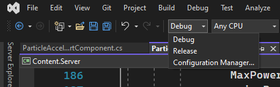

# Mapping

```admonish warning
Use a Tools build of the game. If anything goes wrong, a Tools or Release build is less likely to crash and lose the work up to your last autosave.
```

Please refer to the page contents menu on the right to get to the section that best suits your needs.

This guide is separated into **workflow** (setup, starting a map, saving, useful tools / commands and publishing) and **content** with anything else like glossary at the bottom.

## Refresher
If you've read "Workflow" and are looking for a refresher:

1. To create a new map: `mapping ID`, or
   To edit an existing map: `mapping ID PATH` (e.g. `mapping 3 Maps/saltern.yml`)
   Note that `ID` must be the map number of a map that does not already exist. Use `lsmaps` to see a list of maps that are currently in use.
   
2. If desired, `loadmapacts`

3. Make changes
   
4. If needed, run `fixgridatmos GID`
   
5. Save the map: `savemap ID PATH`. **Important**: If you are working with a salvage or a shuttle, you need `savegrid GRID_ID PATH` instead.

To test the map:

6. Create a map prototype if it doesn't exist, then `forcemap PROTOTYPE-NAME`

7. `restartroundnow`

8. To return to mapping, go to Step 1. Do not save the map while testing.

# Setup
## With Development Environment
A [development environment](../../../general-development/setup/setting-up-a-development-environment.md) and [Git installation](../../../general-development/setup/git-for-the-ss14-developer.md) are strongly recommended, so that you can keep your local mapping server up to date and submit [pull requests](../../../general-development/codebase-info/pull-request-guidelines.md).

### Tools Build
If you are using a development enviroment instead of just hosting a local server, make sure to use Tools instead of Debug/DebugOpt mode. This is because Debug adds artificial lag (making mapping unpleasant) and crashes more (having more assertions enabled).
Additionally be careful to not use Release, which disables development environment tooling and configuration and causes the game to act like a standard server instead of a development environment.

If you have ``runclient Tools.bat`` and ``runserver Tools.bat`` you can run those.

If you don't have the above or want to launch via a console yourself, you can just use:
```
dotnet run --project Content.Server --configuration Tools
dotnet run --project Content.Client --configuration Tools
```

If you are using an IDE, there will be some other way of setting the configuration. For example, in VS there is simply a dropdown menu:


## Without Development Environment
If you choose not to do this, you will need to download a [recent server build](https://central.spacestation14.io/builds/wizards/builds.html).

# Workflow

## Start Mapping

Now to start creating maps follow the below steps:
1. Start both the client and server. On Windows, this can be done by launching both the "runclient.bat" and "runserver.bat" files in your cloned repository directory, after building the project / solution at least once.
2. Once the game client loads up, connect to the server.
3. Press the backtick/tilde key <kbd>`</kbd> to open the debug console, which allows you to run console commands.
4. Run the `mapping [MapID] [MapFile]` command to either create a new map or edit an existing one.
    - To make a new map, specify only the map-id. The ID must be free, i.e., the server cannot currently have another map loaded with the same ID).
    - To edit an existing map in the Maps/ folder you need to specify the map file name. For example, in order to edit the saltern map you can use something like `mapping 2 Maps/saltern.yml`
    - To edit a map you have previously saved you can run the command `mapping 2 [filename.yml]`. These are found in the bin/content.server/data folder.
5. Make all the changes you want to make using sandbox-mode and admin tools. Press <kbd>F5</kbd> to toggle the entity spawner and <kbd>F6</kbd> to toggle the tile spawner. Walls are entities so you'll find them in the entity spawner.
6. In order to save your changes, use the `savemap [MapID] [MapFile]` command. For example, `savemap 2 foo.yml` should save the server's second map to space-station-14/bin/Content.Server/data/foo.yml

## Common Tools and Commands
* <kbd>SHIFT-Click</kbd>: place a **line** of tiles/item/anything with a snap grid
* <kbd>CTRL-Click</kbd>: place a **square** of tiles/item/anything with a snap grid
* By default, the `P` ("Pick") key will select the entity or tile currently under your mouse for placement.
  * Note that this places entities of the same prototype, it does not actually copy the initial entity. 
* To color all pipes in a pipe network use `colornetwork [entity id] Pipe [color]` where the entity ID is any uid of a pipe within a connected network of pipes (Use View Variable on a pipe to find this), and color is a color hex starting with #. See standard pipe colors below.
* `zoom N` to zoom out while mapping. `zoom 3` zooms out 3x. Use `zoom 1` to restore normal zoom.
* You can use the physics shapes command in the debug console to visualize grids.
* To fix erroneously rotated walls, run `fixrotations [GridID]`
* To find your grid entity ID press <kbd>F3</kbd> and hover over the grid with your ghost. The ID will be shown in the top left.
* While in mapping mode you shouldn't require any light. If for any reason everything is dark, run the `togglelight` command in console.
* Use the admin menu (<kbd>F8</kbd>) to toggle other things like showing spawn points and subfloor. This can make it easier to see what you'redoing.
* If you want to test the lighting on your map without leaving the editor, use the "mapinit" command. Do **save before doing this** as it will ruin your map if you save after running this command.
* Use https://affectedarc07.github.io/SS13WebMap/ to see most SS13 maps online
    - (https://game.ss13.moe/minimaps/images/maps/ for the /vg/ ones)
* While testing your map, you might not want to be bothered to set up power each time. In that case, try: `forall with Battery do setbatterypercent $ID 100`
* Map auto-saving is enabled by default and goes to the server data directory every 10 minutes (cvar `mapping.autosave_interval`). You can turn it off with `toggleautosave [map id]` or change the `mapping.autosave` cvar.

## Mapping Actions
The actions toolbar allows you to assign entity, tile, and decal placement actions. These basically serve as shortcuts that allow you to quickly switch to placing common entities/tiles/decals. These actions can be selected either by left-clicking on a filled slot, or using the corresponding keybinding (by default, these are the number keys 0-9). You can also cycle between 10 toolbars using either the arrows on the toolbar, or by using shift + <0-9>.

To assign an entity to a slot, you can just open the entity placement window and click on an entity to start placing it. Clicking on an empty toolbar slot instead of somewhere in the game world will save that entity to that slot. If you are currently in the entity-eraser mode, clicking on an empty slot will instead create a shortcut to the erase-mode. You can assign tile-placement actions in a similar way. Note that tile deletion is simply the same as placing down space-tiles. Finally, to assign decal actions you need to open the decal menu and configure your decal selection. Once again, clicking on an empty slot will add that decal to the toolbar. You can't save a decal-erasing shortcut to the toolbar, as this requires the decal placement window to be open. To remove an action from a slot, simply right click that slot (assuming the action toolbar has not been locked/frozen).

A preset collection of mapping actions can be loaded to the toolbar by using the `loadmapacts` command. Note that as actions are unique to the currently controlled entity, if you use ghost or possession commands you will lose these actions and will have to re-run the command.

## Multi-Grid and Multi-Station Maps
A station and a grid are not the same thing. For example, each asteroid is not it's own station, while a station may consist of multiple grids (e.g. escape shuttles). Most maps only have one grid, though you do still have to set up stations regardless. However, since you can use savemap and loadmap to save/load maps with multiple grids, there is support for overriding this behaviour.

To make a grid part of a station, give it a BecomesStationComponent with a unique ID string (only used for mapping purposes). For example, Saltern's grids have this component with the ID Saltern. You can edit these in VV, or in the map file directly.

To do this in game, find the ID of your station grid using F3 and hovering over a bare tile on the station. Then in console type vv [Grid euID] with the euID from the F3 screen. Navigate to server components and add or search for the BecomeStationComponent. Then add an ID to the relevant field. This ID must match the ID given in your map prototype file. This is the ID given before your roles list.

This means you can have multiple stations loaded in a single map, so do with that what you will.

## Taking a screenshot of your station
To screenshot your station you need both a map prototype, stored on Resources/Maps which is the prototype that the `savemap 2 name.yml` command from previous steps should generate and a game map prototype stored on Resources/Prototypes/Maps which contains the ID, path and other information, refer to the other prototypes in there as examples when making one.

After this, run the command `dotnet run --project Content.MapRenderer {your_map_id_here}`, with the game map prototype ID. You can also set command line arguments through your IDE and run it that way. The image should be inside Resources/MapImages once completed.

## Running your map for the first time
Now that you've completed your map, you'll want to test it in game to ensure you can spawn correctly and there are no issues with doors, access, atmos, power etc etc. To do this:
1. Copy your newly saved mapping file from "space-station-14/bin/Content.Server/data/" to "space-station-14/resources/maps/"

2. Head to "space-station-14/resources/prototypes/maps" and create a .yml file for your map (known as a map prototype). As a guide, copy an existing one and change the name to match your new map, and edit the contents in a word editor like Notepad++ or your prefered method so that your new map has a unique ID and name. See section on multi-grid and multi-station for Station IDs (this is not the same as your map ID).
    
3. You can now relaunch the client and server. Once connected run the command `forcemap [ID]` where the ID is the one specified in the .yml file we mentioned just before. Then run the `restartnow` command to restart the server on your map.

4. Connect to the game and you should now be on your new map. Refer to the troubleshooting section if you're having issues.
    
    
## Testing and getting it into the game
Once you've tested your map by running it in game as shown previously, and you've ran through the quality control checklist as shown here, you're ready to do a pull request to get your map submitted to the game.
    
To pull request:
1. Create a branch on your cloned respository either through your Github client.
2. Add your map and map prototype files to your commit. (Stage them)
4. Commit these two changes to your branch then push them to origin.
5. Head to the upstream SS14 repository and navigate to the pull requests tab. There should be a banner saying something like "recent changes on your branch, pull request?" Do this to open a pull request for your map. Alternatively you can open a pull request from your repository.
6. Fill out the pull request page with details like screenshots / map renders, advising you've followed the quality control checklist, max / min players, and any other details and add a changelog entry.

# Troubleshooting and FAQ
## Loading your map
### I'm getting an error for missing prototypes
If you've recently updated your local copy, an entity ID you're using on the map has since changed. Check the client and server logs for the missing prototype ID.

Then open your map file in a word editor like Notepad++ and do a <kbd>CTRL-F</kbd>, find and replace - and search for the missing prototype ID and replace it with the new prototype ID. Then new ID you can find by checking recent Github PRs, asking on Discord or checking the relevant entity folder on Github.
### I've recently updated and getting a fatal error / won't load
If you've pulled the latest upstream master and you're trying to run the client and server but it's crashing / getting a fatal error - this likely means you need to rebuild the project in your IDE.
    
Open the project in Visual Studio Community or your preferred IDE and Build the project again. If you still get issues, make sure you're on the latest upstream, if necessary pull upstream again, run the "Run_this.py" script to update the submodules and if it still won't work, check discord for the latest info.

# Content
## Map Checklists

To ensure you have all the required items for each area of your map please refer to the PR review Guidelines [here](../guidelines.md) as a guide.

If your map is now complete, follow the attached checklist [here](https://hackmd.io/@Peptide90/MapPublishChecklist) for a quality control checklist to ensure your map is fully functioning. To run your map for the first time refer to the next section.

## Tile Spawner
- When placing tiles as mentioned you can hold ctrl and click to place a rectangle of tiles or shift and click for a line.
- To remove tiles use the "Space" tile.
- You do not need to place plating down first then tiles, you can just place any tile and it will pry up to show the below tile in game (usually plating).
- Similary you can overwrite tiles by placing a new one in its place - no need to remove them first.
- Be careful when placing new tiles that they are part of the correct grid - place them from on top of an existing tile if bulk placing or making sure it snaps to an existing tile. Run `lsgrid` in console periodically to check you haven't created more grids.

## Entity Spawner and Placement
- Search for entities using their ID in the search bar, then you can add it to your action bar on the left side for later use by clicking with ig selected into a slot.
- Use the Snap drop down menu to change the placement mode. For most things you'll want default or snap to centre. Sometimes free placement is needed for a personal touch.
- Remember to rotate certain entities. Some like APCs and buttons can only be accessed from one direction.


## Atmospherics
If you added new rooms or changed layouts, you need to fix roundstart atmos after making those changes. Use the `fixgridatmos [Grid euID]` command to do this. (Press F3 or run lsgrid to find your grid euID)

If you're creating a new map from scratch instead of editing an existing map, then you might want to add an atmosphere to it. There are two commands for this, depending on your needs.

* If you want your map to have a working atmosphere simulation. (gasses spread, etc), use `addatmos 2` Where "2" is the grid ID.
* If you want your map to have a static atmosphere. (gasses don't spread no matter what), use `addunsimulatedatmos 2` Where "2" is the grid ID.

### Mapping Atmospherics Components
In order to create a life support system aboard your map you'll need to create a pipe network or two - one for **distributing** air, and one for pulling **waste** gasses out of the air. Use the following devices in your pipe networks (pipe net):
* **Vents** - use these around your station to distrubute your fresh air.
* **Scrubbers** - connect these to your waste pipe network around the station to scrub bad gasses out of the air.
* **Passive Vents** - use these in your gas distribution tanks such as your air mix tank to connect INTO your distribution network. Also used to vent to space when placed behind a pump and valve
* **Mixers** - Use these to mix gasses into a distribution mix. Make sure to pipe the primary side (the side port) and secondary side (bottom port) as you need for your mix in proportion to the UI. For an air distribution mix you need approximately 78% Nitrogen and 22% Oxygen. The output can then go into an air mix / storage tank or straight to distribution.
* **Filters** - Used to separate a gas from the primary input out of the secondary (bottom) output and pass all remaining gasses out of the other side. Set these up to recycle gasses from your waste pipe net back into your gas tanks.
* **Valves** - Used to manually close off sections of your pipe net. Useful to be placed before a passive vent to space.
* **Pumps** - Used after a passive vent to control the amount of gas pumping into a network. Use these after your gas storage tanks.
* **Atmos Markers** - If you're mapping gas storage tanks, be sure to use the "Atmos Fix (gas) Marker" in the entity spawner to set the tanks to the correct gas. This ensures when you run the fixgridatmos command it puts the correct gas in the tanks.
* **Air Sensor** - Used to connect logic and sensing to other devices to trigger them. Used specifically for Air Alarms and Fire Alarms.
* **Air Alarm** - Used with Air Sensors in order to detect harmful atmospheric conditions on areas and feed alerts to Engineering / Atmospherics. Use machine linking to connect air sensors in **adjacent** rooms to the air alarm, as well as vents and scrubbers in the **current room** to the air alarm. Also connect the firelocks between rooms to the air alarm so that it can trigger them to block off sections.
* **Fire Alarm** - Used to trigger firelocks in the current area. Use machine linking to link it directly to firelocks in it's room or section.
* **Gas Recycler** - Converts carbon dioxide to oxygen and nitrous oxide to nitrogen when the input gas is pressurized to 3 MPa and heated to at least 300 C.
* **Gas Condenser** - Converts gasses into reagents. Probably more important to chemistry or science than atmospherics.

### Standard Pipe Colors
Prefer using standard pipe colors for your atmospherics layout so that players and other mappers can understand it better. Consider an in service ship or station won't often have vibrant colors.

- Waste loop: #990000 (dull red)
- Distro loop: #0055cc (subdued blue)
- Air: #03fcd3 (cyan)
- Mix: #947507 (brownish)

## Power
Your power network consists of HV, MV and LV wires. In all cases the wire needs to be placed **UNDER** the respective device to connect, except in the case of LV consumers as noted below:
* **HV wires** are your transmission lines between and generators, power storage (SMES) and your substations.
* **MV wires** connect between your substations and your APCs. Make sure to place them under both devices.
* **LV wires** or APC wires connect from your APCs to all consumers in a 3 tile radius (so don't place them under things, you don't need to).

Your main devices on a power network are as follows:
* **Substation** - Store a small amount of power. Connect to the main network via HV cables taking the power in and distribute that power our via MV cables to many APCs.
* **APC** - Area Power Controllers. Store a tiny amount of power depending on the cell inside. Connect to a substation via an MV cable. An LV cable under them is then used to provide power to consumers. Make sure to place these facing the direction they will be used.
* **SMES** - Used to store huge amounts of power on a HV network. Cannot cable between SMES' so you need to wire out then back in.
* **Cable Terminal** - Used to separate circuits on your HV network. Your primary circuit is on the side with the box and your secondary side (output) is where the cables point. Place these pointing into a bank of SMES' so your generation is on the primary side and your main network is coming out of the SMES through the cable side of the cable terminal (see picture below for visual aid). The secondary side will drain from the primary side so use these sparingly on the secondary circuit.
* **Generators** - This can be portable generators, plasma collectors, solar panels and more. Stick a HV cable under these to use the generated power. This includes the AME controller.
* **PA Power Box** - Special mention, in order to power the particle accelerator you need a HV cable under the PA cable / power box.

For all other details relating to power such as setting up engines, refer to the gameplay wiki [here](https://wiki.spacestation14.io/wiki/Power).
    
## Decals
Decals allow mappers to add low-cost effects such as warning lines, dirt/rust or tile overlays to maps.

The decal placer is available in the adminbus menu, the sandbox menu, or by pressing F8. The controls are as follows:

* Left click to place decal
* Right click to remove decals in range

Decals can be tinted custom colors with RGBA, can be made cleanable, can be ordered according to drawdepth, and can be rotated to any angle, though the spinbox defaults to increments of 90 degrees.

If you're unable to place decals, close and reopen the menu. Tiles and entities cannot be placed while the Decal Placer is open, and you cannot do interactions either as it overrides them.

### Palettes
Palettes can be selected in the decal menu. These are commonly used colors like departmental ones (sec, command, service, etc) which can be selected.

You can add your own palettes very easily. Simply go to Resources/Prototypes/Palettes, copy one of the templates into a new file, and change the ID/name as well as the colors you'd like to use. The colors are in the hex format RRGGBBAA.

## Warp Points, Station Beacons and Station Maps
All maps need warp points so observers can get around quicker.

Most maps now will use **Station Beacon**s instead of warp point as they already include the named warp point component on them. Place these in the relevant rooms of your station **instead** of warp points. This will allow them to populate station maps correctly.

If you want to allow people to ghost warp to a location but don't want it to show up on a station map, or it's not suitable for a station beacon (planets, player griefing by moving the warp point, other reasons) then use the classic purple warp point marker. Place it, then right click, view variable, navigate to serverside components, search for the warp component, then alter the name in that component to reflect what you want in the warp menu.

## Naming Doors and Editing Signs
View variable (VV) is your friend. Right click an entity such as a door or sign and navigate to the server variables tab. In here you can edit the name and description of any entity on your map.

Use this to name specific doors on your map or give flavor to warning signs and buttons to make their purpose more obvious to players.

## Vehicle Spawners
- To map vehicles, similar to animals, you need to use the spawner and not the actual entity.
- Once mapped make sure to also map a set of keys.

## Cameras
- Place a "Camera Router" for your specific department in a secure area, such as a head access closet / server room in the department, or server/router location.
- Place your Surveillance Cameras (insert department) around the station. When placing them, to fix the name that appears on the Camera Monitor you'll want to: Right Click > Debug > View Variable > Server Components > SurveillanceCameraComponent > edit the *CameraID* and hit enter.
- Place a Camera Monitor, ideally somewhere more secure so anyone can't check in on it.
- If you want to test your cameras view, save your map then run mapinit. You can then view the camera monitor and check their view, make sure to run togglelight in console to get the actual view.
- For entertainment cameras, follow the same process as above but with cameras marked (entertainment).

## Telecoms
Stations require a telecommunication server in order for headsets and radios to work correctly. Make sure to place a `TelecomServerFilled` somewhere on your map and sign post it and put a station beacon in there.

## Machine Linking (Multitool, Blast Doors, Conveyors etc)
Machine linking works exactly how it does in game. Spawn yourself a multitool from the entity spawner and with it in hands, click on your entity you want to link (conveyors, blast doors, shutters etc) then click on a suitable input such as a button, switch or lever. Then select the way you want to link it, in most cases, default linking is best.

The default range of inputs like buttons is 30 tiles. If your button is further away you can edit the range using view variable. Right click > debug > view variable > server components > transmission component. Edit the range to suit your needs. Try to keep near enough the same as your target otherwise you might find it can be abused in game.

## Cargo Shuttle
To enable the cargo shuttle for testing on a local server, run the following in the server console:

	sudo cvar shuttle.cargo true

## Escape Pods
To map escape pods, simply map the docking airlock with the suffix `escape 3x4`. Make sure to leave a 3x4 gap of space outside the dock for it to spawn when the map is initialised, plus at least a tile of space around that gap for logical reasons.

# Planets
This is a space station simulator, after all, but if for some reason you need maps that function like planets that have a breathable atmosphere and gravity that can't be turned off (see the Nukie Planet):

>  There is a helper command `planet` that will apply sensible defaults for most of the below to an existing map.

1. Create a new map normally using `mapping`. It is not necessary to add a gravity generator nor `fixgridatmos` (yet), because of the following steps.
2. Open the Admin Menu (<kbd>F7</kbd>) → Objects → Maps, find the new map that you just created, click on it to pull up View Variables. Under Server Components → Add Component:
   - Add *Gravity*.
   - Add *FootstepModifier* and set the sound via VV.
   - Add *Parallax* and set the parallax prototype. If you wish to make it look like ground then you will need to make a new one.
   - Add *MapGrid* to the map.
   - Add *MapAtmosphere*
     - Set *Space* to False
     - Set *Mixture* to what your planet atmosphere should look like. Fields to pay attention to are temperature (290K is a good choice) and initial moles (22 mol O2, 82 mol N2) are good choices
     - The extra fun is that the *Mixture* field is not editable in vv, so you get to save the map, pop open your text editor, find the MapAtmosphere component, and manually patch it in.
     ```
       - space: False
         mixture:
           volume: 2500
           temperature: 290
           moles:
           - 21.824879
           - 82.10312
         type: MapAtmosphere
     ```
     - After loading it back, now run `fixgridatmos`

3. Open the Admin Menu (<kbd>F7</kbd>) → Objects → **Grids** (not Maps!), find the new grid for the map that you just created, click on it to pull up View Variables. Under Server Components:
   - Because you added *Gravity* to the map, this grid now has *Gravity*. Open it up and:
     - Set *EnableVV* to True\
    
4. Save and test.

# Mapping Standards
## Docking Ports / Evac / Escape
For escape / evac docks we use the 5-3-5 layout which is 5 tiles, 3 space gap and 5 tiles. The 5 tile portion should ideally be glass-dock-glass/-dock-glass where the glass is reinforced glass or reinforced wall. We suggest leaving a gap of at least 5 tiles either side of the docking area too, more if you can afford it, so ships can dock easier.

We strongly suggest using the glass variant of the docking airlocks so people can see through and not accidentally space the station. The dock can be as far away from the station as you like, with sufficient airlocks between the station and the last space facing docking airlock. This area should be well lit with an emergency light close by so docking shuttles can see the situation inside.

## Arrivals Dock
Arrivals dock can follow either the hangar type format or the flat type dock as seen with the escape dock above.

* Hangar type as the name describes is a dock that wraps around the docking shuttle like a U shape. This should attempt to follow the same spacing as the flat dock so should have a 5 space buffer from the station for the ship to park in, then the first 5 of the 5-3-5 starts. For arrivals there is only the need for one set of airlocks of, so this is more of a 5 space, 5 tile design.
* Flat type should follow the same format as the escape dock so 5-3-5 with a 5 wide space gap either side.

## The Docking Arm
All maps should also have a docking arm in addition to the arrivals and escape docks. The docking arm must have the following features: 

* Protrude from the station with no immediate obstructions either side of it for at least 20 tiles either side. 
* This is to allow large ships for events to dock with ease.
* The docking arm should have at least a 2 tile wide docking airlock to allow structures to be dragged through it easily.
