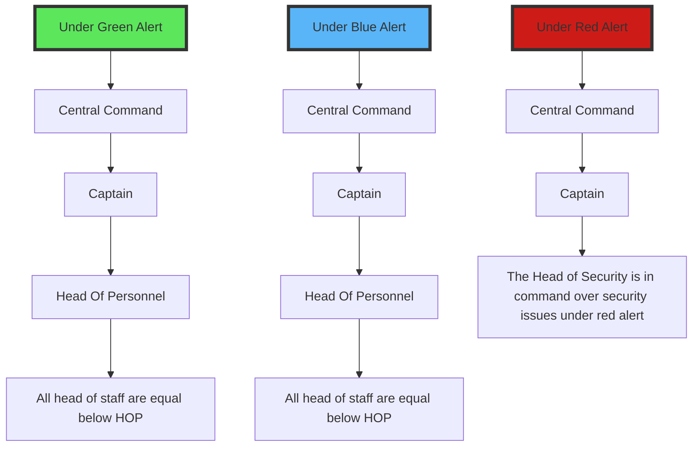

# Departmental Operating Procedure (DOP)

## Abstract

--- 

The DOP is an in-character set of guidelines oriented towards MRP servers. Each department will have it's own 'Operating Procedure' that will prepare it for any encounters it may face while in space. This will serve as a way to encourage roleplay and more belivable in-character behavior. 

The DOP will act as a guideline for departments to follow but not rules. This will allow for chaos to still ensue even when everything goes according to plan. 

## How will this look per department?

---

### Command: 

Command will follow the "Command Operating Procedure"(COP), it will feature a "Chain of Command", "Bolting Procedure", "Alert Procedure", and a "Commanding Officers Work Behavior Guideline"

#### Examples for Command: 

##### Chain of Command 

