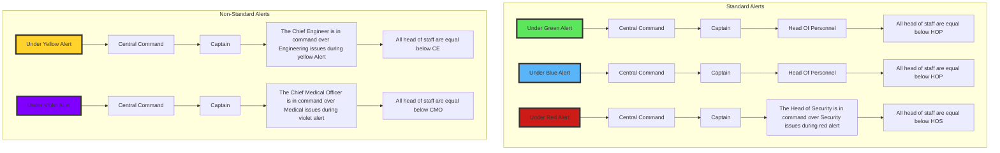

# Departmental Operating Procedure (DOP)

## Abstract

--- 

The DOP is an in-character set of guidelines oriented towards MRP servers. Each department will have it's own 'Operating Procedure' that will prepare it for any encounters it may face while in space. This will serve as a way to encourage roleplay and more belivable in-character behavior. 

The DOP will act as a guideline for departments to follow but not rules. This will allow for chaos to still ensue even when everything goes according to plan. 

## Core Idea

My intention with a DOP is to encourage Roleplay but not to enforce it with server rules, this instead is a set of in-character books and guidebook entries that will push players into a more RP centric enviorment. This proposal is more focused towards MRP servers but these guidelines can still be found and used within LRP servers. 

I will split these procedures between two categories 

* Flavor Text
  - Nanotrasen themed guides that offer more fun than actual advice, think of things like "Interogation 101" which will feature an interogation guide complete with responses to certain answers, pretty much useless in terms of advice but is a fun bit of lore that is distrubted to security teams across Nanotrasen stations
* Guidelines
    - Think of these as the original SOP, a set of straight forward points and guides to explain how a department is to be run, but do not limit roleplay and instead encourage more. With things like medical evaluations and alert procedures. These could be appended with 'guideline' or just left as is such as "Alert Procedure" instead of "Alert Procedure Guidelines". 

## How will this look per department? NOTE: This is my example. I think this could be achieved in many ways but this is how I would do it. 

---

### Command: 

Command will follow the "Command Operating Procedure"(COP), it will feature things like a "Chain of Command", "Bolting Procedure", "Alert Procedure", and a "Commanding Officers Work Behavior Guideline"

#### Examples for Command: 

##### Chain of Command 

### Security: 

Security will follow the "Security Operating Procedure" (SOP), it will feature things like "Security Dresscode", "Optimal Proccessing Time Guideline", "Scene Response Guideline", "Evidence Handling and Collection Guideline", and "Interrogations 101" 

I plan for these to add not only some interesting guidelines that will hopefully improve roleplay, but to also add lore. You may have noticed at this point but a lot of these are named like guidelines you would see in an office, and that is sort of my intention. I am hoping to add lore friendly Nanotrasen guidebooks for each department. With fun tidbits and interesting insights to the departments. 

### Engineering: 

Engineering will follow the "Engineering & Atmospherics Operating Procedure" (EAOP), it will feature things like "Station Modification Guidelines", "Departmental Repair Guidelines", and "Maintaining Clean Air"

These guidelines will largely be a way to roleplay building things 'to code' as well as some more lore focused documentation like "Maintaining Clean Air" 

### Cargo

Cargo will follow the "Logistical Operating Procedure" (LOP), it will feature things like "Supply and Demand", "Cargo Handling Guidelines", and "Salvage Technician Safety Guide"

These guidelines much like engineering will encourage roleplay within cargo by offering a set of guidelines to follow as well as adding some lore text with things like "Supply and Demand"

### Medical

Medical will follow the "Medical Operating Procedure" (MOP), it will feature things like "Medical Evaluation Guidelines", "Keeping Your Patients Happy", and "Psychology 101"

### Research

Research will follow the "Research Operating Procedure" (ROP), it will feature things like "Research and Develeopment: How not to blow up", "Research Operation Guidelines", and "Human Experimentation: An Art" 

### Service

Service will not have it's own Operating Procedure and will instead have guidelines and more lore focused text for each job I.E. Chef, Janitor, and Barkeep. 

---

## Inspirations and places I took from. 

* Aurorastation has an excellent operating procedure with many different guidelines that I took a lot of inspiration from, I think it uses a lot of simple guidelines in very interesting ways.
* The original SOP, I really liked this SOP and took a lot of inspiration from it and I hope with this I can create a more open ended SOP that accomadates both an LRP and MRP audience.
* Old workplace guidebooks, I think SS13 used these a lot as inspirations as well. Trying to make something lighthearted out of police interogations or Medical Evaluations feels very in line with how SS13 and 14 operate. 
