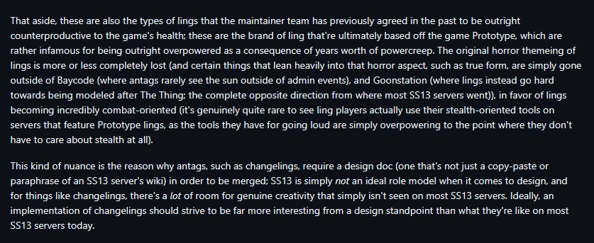
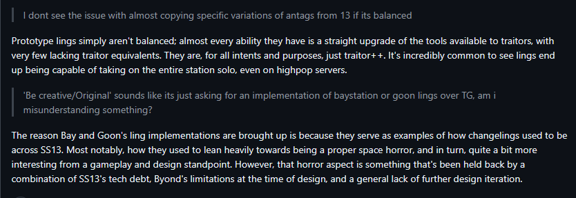
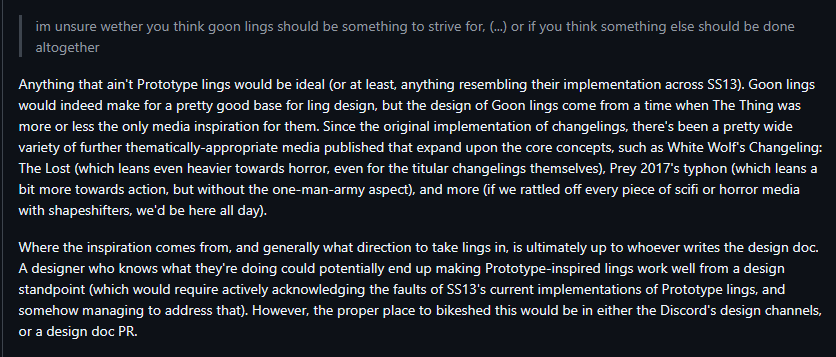

```admonish warning
The changeling is currently in active development and this document will be updated along with it.
If you want to help out see the [changeling development tracker issue](https://github.com/space-wizards/space-station-14/issues/39439) where we will list current bugs and the next steps in the development.
```
# Changeling

| Designers | Coders | Implemented | GitHub Links |
|---|---|---|---|
| Slarticodefast| poklj<br/>ScarKy0<br/>Slarticodefast | :warning: Partially | [#34002](https://github.com/space-wizards/space-station-14/pull/34002) Devour and transform<br/>[#39439](https://github.com/space-wizards/space-station-14/issues/39439) Development overview|

Based on the classis SS13 antagonist, see the [tg](https://wiki.tgstation13.org/Changeling) or [Goonstation](https://wiki.ss13.co/Changeling) wiki for reference.
This design doc largely rewrites and supercedes the previously accepted design doc, which can be found [here](https://github.com/space-wizards/docs/pull/263).

A previous [upstream PR](https://github.com/space-wizards/space-station-14/pull/30094) for the changeling was closed after it has been abandoned by the author and later been used as a basis for PRs on multiple SS14 downstreams. However, most of the code will need to be rewritten from scratch for upstream as it did not meet code quality standards.

## Overview

The changeling is a roundstart or midround antagonist based on the [1982 movie](https://en.wikipedia.org/wiki/The_Thing_(1982_film)) *The Thing*. A changeling is an extraterrestrial biological creature disguised as a humanoid species and is able shift its identity into that of the victims it devoured. Hiding among the crew to survive it will create paranoia and conflict among crew members as they struggle to find out who is real and who has been replaced.

## Background

The implementations and abilities of the changeling vastly differ among SS13 codebases or SS14 downstreams. Here is a short summary of some major forks:

#### tg
- Also known as *prototype* ling and heavily inspired by the [Prototype](https://en.wikipedia.org/wiki/Prototype_(video_game)) video game series.
- Lots of combat focused abilities like armor, shields, multiple weapons, speed boosts, and shrieks that cause debuffs to nearby enemies.
- Uses *chemicals*, a rapidly regenerating resource shown in an alert, to activate abilities. Some interactions like BZ gas or the *changeling sting* bartender drink are able to affect the chemical regeneration rate.
- A fixed amount of ability points called *DNA* at roundstart that can be used in a store to purchase abilities. Devouring someone allows you to respec.
- All changelings can communicate over a telepathic hivemind radio channel under an alias so they can coordinate.

#### GoonStation
- Thematically and visually much closer to *The Thing*.
- The hivemind: Devoured players become part of the changeling when devoured and are able to communicate with the main player via telepathic chat. They will leave the hivemind and are allowed to remember it when their body is revived or borged.
- Can summon minions that will be controlled by hiveminded players.
- Abilities are purchased with DNA, which can be obtained by devouring other players.
- The horror form, a transformation with improved combat abilities that is available after devouring 3 players. Continuously consumes DNA points to keep active (one devoured player gives you 5 seconds of this ability)
- No chemicals, only the horror form uses DNA for upkeep. Otherwise abilities only rely on cooldowns.

#### SS14 downstreams
- Mostly based on the previous [upstream PR](https://github.com/space-wizards/space-station-14/pull/30094) and design doc and the prototype-style changeling.
- Biomass, a hunger stat that slowly decreases, forcing the changeling to continuously devour other players, or it will show withdrawal symptoms outing them as a changeling and eventually die.
- Biomass is also used to purchase abilities.

Some comments from a previous maintainer discussion on why the prototype changeling is problematic:







## Features to be added

### Objectives
- **Survive and escape to CentCom**: Hide among the crew to avoid getting killed.
- **Escape with identity**: In addition to escaping alive, the changeling must have transformed to the target person and wear an ID card with the target's name on it to succeed.
- **Absorb DNA**: Absorb the DNA of a certain number of players. You just need to get DNA, the easiest way is using the DNA extraction sting. Alternatively this could require the changeling to kill and devour the target instead (not allowing the sting) so that the objective becomes more challenging and to increase the changeling's round impact as an antagonist.
- **Assassinate/Maroon a person**: Kill some unlucky crewmember. This can be fulfilled via normal means or through some of your various abilities.
- (Optional) **Absorb another Changeling**: You have to kill and then absorb another changeling. This is an objective in SS13, but may need some testing to see how traitor vs. traitor gameplay impacts the roundflow.

### Abilities
- **DNA Store** (innate): An intrinsic store allowing the changeling to purchase new abilities using *DNA points*. At round start only a small amount of DNA should be available and more can be obtained by devouring players, encouraging the player to kill without being noticed and allows them to grow and adapt as the station becomes aware of the changeling threat. Some basic abilities are innate and always available without needing a purchase.
- **Devour** (innate): (Not to be confused with the Dragon's devour ability, which stores the victim in its stomach). Starts a DoAfter slowly devouring a dead humanoid. Once complete you absorb their identity and are able to transform into them. The amount of identities that can be stored is limited and at some point the player has to drop some stored identities to be able to absorb more.
- **Transform** (innate): Select one of your devoured identities via a radial menu to transform into them, copying their appearance, traits and species-specific abilities. This creates a perfect copy similar to paradox clones that has the original's voice, DNA, fingerprints etc. making the changeling indistinguishable from the devoured player.
- **Flesh Disguise**: A toggleable upgrade to the transformation ability, which allows you also make a copy of devoured humanoids' clothing items when transforming into them, allowing you to quickly switch between multiple identities without having to carry around all their equipment. The copied items are non-functional (for example helmet flashlights or magboot effects won't work) and are only visually identical. The copies will disappear with a popup if another player tries to strip them off you, meaning this ability comes with the drawback of being easier to identify as a changeling. If a changeling wants to prevent this from happening they will have to steal and wear the original's clothing instead.
- **Regenerative Stasis** (innate): Fakes your death, and allows you to fully heal after a while. You cannot move while in stasis. The changeling can choose when they want to exit the stasis once the minimum time is over, allowing them to use it for surprise attacks. Being healed this way is highly visible to other players (via a popup and sound effect). This ability makes a changeling hard to kill unless gibbed or cremated. The cooldown should be large enough so that the crew is able to get rid of the changeling in time if they are aware of its nature and to prevent the changeling from repeatedly healing in offensive combat. While stasis is activated the changeling player should be unable to ghost from their body to prevent them from seeing OOC information.
- **Arm Blade**: The changeling's main combat weapon, turning one of your hands into a blade made of flesh. However, it is visible on your body and a dead giveaway to onlookers that you are a changeling. Can also be used to pry open airlocks.
- **Lesser Form**: Turn into a monkey, allowing you to vent crawl. Will also drop handcuffs if you transform. Should use the normal transformation radial menu instead of an extra action.
- **Horror Form**: An advanced tranformation turning the changeling into a shambling abomination. Requires a certain number of devoured victims to be unlocked. Does not cost DNA to activate, but has a passive DNA cost while active and the changeling will transform back if they run out. The horror form has better combat stats similar to those of a space dragon and is intended as a last resort when threatened or exposed.
- **Biodegrade**: Dissolves handcuffs or other restraining items, allowing the changeling to escape. This is obvious to nearby people (via sound and popup) and leaves a puddle of acid.
- **Mimic voice**: An intrinsic voice mask, allowing you to change your voice at will and cause confusion among the crew.
- **Last resort**: Gibs your current body and you become a head slug (similar to diona nymphs), which is able to vent crawl, allowing you to escape. The head slug is weak in combat, but if it finds a corpse it can take it over and turn back into a full changeling again.
- **Apex Predator**: Allows you to mark a target and keep track of their location with an intrinsic pinpointer, allowing you to stalk them (this should use an overlay rather than an actual pinpointer or station map).
- (optional, needs playtesting) **Tentacle**: Allows you to grab items or people from afar and pull them towards you. Will need to be tested to see how it affects combat.
- **Stings**:
  Stings are silent attacks that the victim does not notice until their effect sets in, allowing the changeling to stealthily attack a single target or cause confusion within a group of players without letting them know which one of them caused it. Most stings work similar to a hypospray by injecting a certain reagent.
  - **Extract DNA Sting**: Steal someone's identity silently without having to devour them. Does not grant additional DNA points for store purchases though since this would be too easy. In SS13 you can Alt-click or use your middle mouse button to sting someone with your currently active sting.
  - **Mute Sting**: Injects mute toxin. The victim won't notice until they try speaking.
  - **Blind Sting**: Temporarily (partially) blinds the target or worsens its eye sight after a short moment. Should not be too overpowered as it basically makes you unable to fight.
  - **Hallucination Sting**: Causes the target to hallucinate. Ideally this would be better hallucinations than just the seeing rainbows effect. Maybe use drunkenness as a placeholder?
  - **Neurodepressant Sting**: Causes drowsiness and erratic movement.
  - (optional, needs playtesting) **Transformation Sting**: Temporarily turns someone else into one of your stored identities. Should not be permanent because some players might not like not being able to play as their own character anymore.
  - (optional, needs playtesting) **Madness Sting**: After some time, it temporarily turns the target into a mindless berserker who attacks everyone in sight (including you). Can be used for situations where you accuse someone else to be a changeling.

### Chemicals
Due to the large amount of separate abilities the changeling has they would be able to activate all of them in quick succession since cooldowns are only considered for each action individually. To prevent this from happening all changeling abilities require a shared resource called chemicals. These slowly refill over time and the current level is shown to the changeling player as an alert. Ability costs should be balanced such that the changeling cannot quickly use multiple strong offensive abilities while in combat. Abilities intended for fleeing and disguising on the other hand should be cheaper to encourage stealth gameplay.
Some other game mechanics might be able cause buffs or debuffs to chemical regeneration speed, for example certain atmos gases or reagents.

### Possible future additions
- **Hive Mind and summoning eyespiders, handspiders, legworms**: This could potentially be playtested to see how it works on LRP. However, it might cause some player conflict if someone is unhappy that they have been killed by the changeling and might try to sabotage them as a result. The telepathic hivemind chat will require the chat refactor first.
### Abilities that should not be added
- **Regeneration abilities other than stasis**: Any sort of passive healing or quick healing that is viable during combat should be avoided as it encourages the changeling to actively seek out open fights with security and possibly killing large parts of the station. Additionally our medical system is not detailed enough yet to warrant different forms of healing (such as regrowing organs).
- **Armor or shields**: Same reason as above, changeling abilities should be stealth focused.
- **Shrieks or other offensive combat abilities that target multiple enemies**: Same reason as above, with the exception of abilities that are only available in the horror form.
- **Stronger variants of the armblade**: The changeling should only seek out one on one combat and avoid facing multiple enemies at once.
- **Adrenaline or other abilities granting stun resist or movement speed boosts**: Way too powerful when used in offensive combat as it has a much higher impact in SS14's fast-paced pixel movement combat than it did in SS13 tile movement.
- **Bone shards and other throwing or gun-like weapons**: Ranged weapons encourage offensive combat rather than surprise attacks.
- **Abilities that mirror traitor tools**: For example EMPs. The changeling should have its own identity as an antagonist and set itself apart from the rest, keeping the spirit of the original horror movie theme.
- **Biomass**: We already have two stats to keep track of, chemicals and DNA, which is similarly used to buy new abilities after gaining points from devouring. Three separate systems would be too many mechanics at once. Additionally biomass acting as a hunger value is very problematic for gameplay - the changeling is encouraged to continously kill other players to stay alive themselves and to indiscriminately attack anyone when their hunger reaches a critical level. If it is known that changelings exists it also encourages security to just lock all players up and wait until they show withdrawal symptoms, outing them as a changeling.
- **Husking**: In SS13 and SS14 downstreams devouring a player will completely round remove them by husking their body, which makes them unidentifyable and permanently unreviveable. This leads to changeling causing mass-round removal and is especially frustrating for any victims being devoured very early in the round. Even without husking a changeling will still be able to hide the devoured victim's body and take their ID card if they deem it necessary.

### Identifying Changelings:
Changelings expose themselves to the crew by using some of their non-stealth abilities (for example the arm blade) while being seen by others, or by someone hearing the changeling-specific audio effects. The changeling player should try to lure players into maintainance or other hidden areas to delay being revealed as long as possible and have more time to devour players before the crew can mobilize against them.

Once the crew becomes aware of the changeling they will have to keep track of known devoured identities to know who they cannot trust.

Additionally they will be able to use a blood test to identify changelings. Depending on the exact implementation this could be done by making changeling blood explode by either heating it up or centrifuging. The former would be widely available to everyone (once solutions can be heated up by welders instead of only with hot plates), where as the latter would provide a single point of failure that the changeling could sabotage. Which of these options is better for the round flow would need some playtesting.
The blood test is intended to encourage the changeling to stay on the move, rapidly switching between multiple identities to escape, and to prevent the round from stalling. However it should not be too easy as that would lead to scenarios where the crew decides to immediately test everyone before the changeling has any chances to act. For the same reason the transformation ability should be made as perfect as possible to avoid easy antag-checking.

Ideally the changeling game rule will be part of a dynamic game mode to prevent metagaming scenarios where the players identifying one changeling will inform them about the existence of multiple others at round start.

## Game Design Rationale
The changeling is strongly rooted in horror movie aesthetics and heavily leans into the classic space-horror trope. Sound effects, visual cues, and contextual popup messages are used to reinforce this unsettling feeling and signal danger to the nearby crew. With its biological abilities the changeling sets itself apart thematically from the other antagonists. 
Using transformation and other deception abilities it will cause false accusations, paranoia, chaos and emergent story-telling. Other players are encouraged to work together socially to deduct the identity of the changelings hiding among them, and security and command roles gain importance as social authorities. Being part of the crew itself, the changeling poses a threat from within the station rather than from the outside.

## Roundflow & Player interaction

#### Intended roundflow
- Hit and run tactics. Luring other players away or surprising someone in maintenance areas to kill and devour them without being noticed.
- Abilities that can silently take out a single target, but are weak against multiple opponents.
- The changeling spreads fear and paranoia among the crew as they struggle to find out who is real and who has been replaced by a changeling. The changeling should have abilities like mimicing voices that amplify this.
- The changeling will be able to use its abilities to flee if caught and will then be able to tranform into someone else to get rid of their pursuers. They will then again hide among the crew and will have more chances to achieve their objectives.
- The changeling is a long-form threat that escalates over time instead of peaking immediately. By gaining new abilities it will be able to adapt to the crew becoming increasingly aware of its existence.

#### Non-intended roundflow
- Round removing large parts of the crew.
- The changeling singlehandedly taking on all of security in active combat.
- Major station sabotage, causing a singoloose etc.

#### Avoiding combat focus, encourage stealth gameplay
The changeling should not be able to kill all of security or large parts of the crew. Such behaviour, commonly known as murderboning or mass round removal, is not much fun for anyone except the antagonist themselves, and effectively ends the round for many players. Abilities should be designed in such a way that they do not encourage the changeling player to seek fights with multiple enemies at once. Armor, simultaneous debuffs against multiple enemies, rapid health regeneration without stasis, speed boosts and similar highly effective combat abilities should not be added. Abilities should instead focus on escaping from combat, stealth, and surprise attacks on single enemies.
The horror form is only intended as a last resort defense, unlocked later in the round and time limited to prevent the player from repeatedly using it.

# Technical Considerations

- Devouring someone creates a backup copy of the devoured entity using `CloningSystem`. The backup is stored on a separate paused map unreachable for players, but can be used for sprite previews in the transformation UI by giving the changeling player a PVS override.
- Transforming also uses `CloningSystem` to apply the components from the backup to the changeling when they transform. This is generally handled via a component whitelist in the `CloningSettingsPrototype` and `CopyComp`, but more complex component that need to run specific API methods can use a `CloningEvent` subscription.
- `CloningSystem` is also used for paradox clones and cloning pods, meaning if a species ability or trait is compatible with those it should work for changeling transformations as well. This should help avoiding code duplication, keep the code maintainable and reduce the required effort for forks to make their species compatible.
- `CloningSystem` will be expanded to also allow adding or removing `HumanioidAppearanceComponent`, which will allow transforming into non-humanoids like monkeys for the lesser form ability. The use of `PolymorphSystem` should be avoided as it creates a new entity, transfers the player's mind and moves the old one to a paused map. However, since the player will have a new `EntityUid` this will come with a whole range of problems for any component that tracks the old uid, breaking features like objectives, station records, entities stored in containers, status effects and so on.
- Interactions should be designed in such a way to minimize the amount of action icons needed as these can become messy to handle in large numbers, especially in combat situations. If possible radial menus or clickable alert icons should be used instead of having separate actions for toggleable or selectable abilities.
- Chemicals should be using the [hunger/thirst refactor](https://github.com/space-wizards/space-station-14/pull/34166) which combines them into a common satiation system instead of implementing a lot of similar code.
