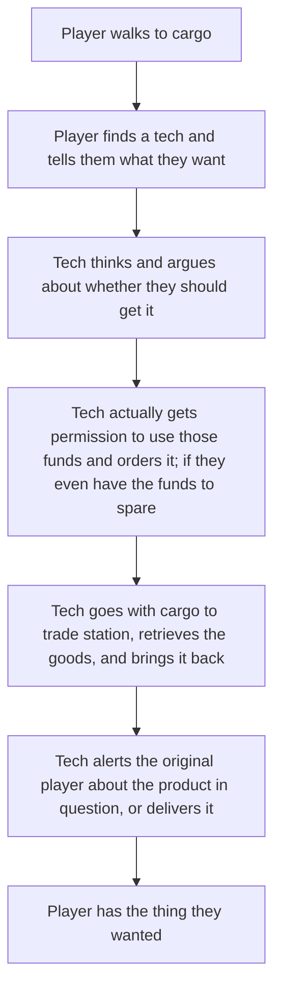
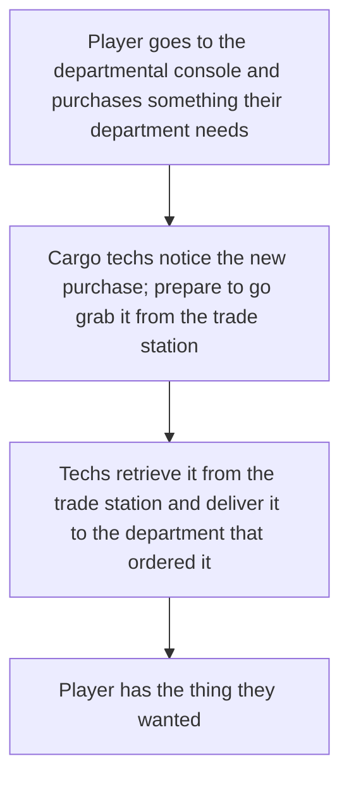

# Departmental Economy

| Designers | Implemented | GitHub Links |
|---|---|---|
| mirrorcult | :x: No | TBD |

The purpose of this proposal is to create a system of economic interactions within the game that adds gameplay, increases player and departmental agency, while also introducing avenues of player interaction that weren't previously possible. Rather than being shoehorned in for the sake of it and interactions thought of later (grumble grumble), the economy implementation here seeks to solves actually existing design problems in intuitive ways while freeing, not restricting, design space in its interactions.

## Some Background

I'm here to convince you that there currently exists a problem of friction in the current cargo workflow, (mostly) irrespective of things like trade station / shuttle travel time. The current gameplay flow for a player that wants something looks sort of like this:

Each step of this introduces some potential friction, potential latency, potential chance for incompetency or failure, etc. That's not *necessarily* a bad thing but this is enough friction that people will either just not bother or will get (justifiably) pretty mad when they're unable to do something because of something that is entirely out of their control. 

## Problems

There are a couple key issues to focus on:
- Cargo has to act as a middleman at several different steps here (requesting, purchasing, & delivering) when it's not much more interesting than if they were a middleman at one singular point
- Cargo having to use their own money on purchases for other people means incentives are aligned badly for the outcome we actually want (people get the things they request)--again, not *necessarily* a fundamental problem, but introduces severe friction
- With basically every step except begging isolated to cargo, players in departments feel like they have very little agency when it comes to making decisions on how to acquire the supplies they need

## Solutions

We'll explore a couple concepts I'd like to introduce for an economy system, then circle back and see how it affects the overall flow for a department looking to supply itself.

### Departmental Funds

**Departmental funds** break up the current existing 'station bank account' into separate ones for each department. Cargo gets their own bank account as well, of course, but so do *service*, *science*, *medical*, *security*, and *engineering*. Implications for this are discussed next.

### Decentralized Recquisitions

Each department with its own bank account now has *its own* cargo purchasing terminal in their department. Members of the department can select what to order, and purchases made are announced to the department radio channel as well as to the cargo channel. Purchases are made using the funds of the department that ordered it, meaning it is independent of the choices other departments may make.

This is not a 'request' to cargo--when the purchase is made, money is removed from the department's account and the order will appear at the trade station. Cargo's job now is to manage these orders and deliver them properly, rather than to also manage taking orders & deciding for everyone what to buy.

Cargo is, of course, allowed to purchase things for themselves still if they'd like to get silly with it.

#### Departmental selling with lockboxes

Of course one valid question is how selling factors into this whole ordeal. There's a couple potential ways to handle this, but the one I'm proposing here is to give each department a set of *lockboxes* roundstart--indestructible containers which are simply locked and unlocked with their departmental access--that, when brought to cargo and eventually sold, give 75% of their profits to the department in question, and 25% to cargo, to incentivize them to actually sell the shit they're given.

When cargo sells something (not in a lockbox), 75% goes to cargo and 25% is divvied out to the other departments the same way funding is allocated. Perfect segue to the next section!

### NT Research Funding & Allocation

Since money will now be more relevant to everyone and selling isn't a viable source of income for a lot of departments (like medical or engineering), I'm choosing to include an alternative source of money that integrates very well with the game, has fun lore implications, and still centers around player interaction.

This source is **NanoTrasen research funding**. The station exists for a reason--supposedly it is a *research* station, and it can't do its job without some research funding! The 'research' here doesn't refer specifically to the department, but to what the station exists to do in the first place. In my concept here, the station's purpose is to research how well a station's crew can fare under intense pressure and environmental as well as internal danger. **The more 'research' being done** (i.e., uh, how dangerous the station is), **the more research funding rewarded**. Bring it to the brink.

Every 10-15 minutes (or some other arbitrary interval, you get the idea), NT will observe how dangerous the station is based on some metrics, including things like:
- Dead / injured crew
- Destroyed machines / lack of power
- Number of threats (anomalies, hostile mobs, etc)

The more dangerous the station is, the more funding is given, along with some flavor text congratulating the station, or impugning them if not enough was given. If the emergency shuttle is called, funding is *paused* until the shuttle is recalled, as this is viewed as the crew "ending the experiment". If the emergency shuttle is called below a certain danger level or too early, NanoTrasen might force you to pay up as recompense.

How is it determined where the funding goes, you may ask? A valid question! With this system, the Head of Personnel will acquire a new **Funding Allocation Console** in their office which can be used to determine the percentage each department receives from each injection of funds (as well as from sold cargo goods mentioned above). It will start with a default sensible split (with some light variation, or rarely heavy variation) in the event that there is no HoP (or they don't bother changing it ever), which is as follows:

- medical: **30%**
- engineering: **25%**
- security: **20%**
- science: **15%**
- service: **10%**
- cargo: **0%** -- cargo is expected to make their money through good old profiteering

The HoP is expected to change the allocation over time as it becomes clear which departments need it the most, or to just give it all to whoever the HoP wants to stop bothering them. It goes without saying that this console is merely access restricted and can be changed by anyone who hacks in, though the HoP is its natural owner. Of course, any changes are easily undone as long as its noticed, since it only applies once funding or sales actually come in. This system is both carrot and stick: science doing a good job? Give them a bonus! Science spamming morbs and refusing to remove them? That money goes to service & the clown instead, who will probably use it better.

When a new round of funding comes in and is announced to everyone, the distribution and exact number of funds given to each department is also displayed.

### Transfers & Siphoning

Any good economy system needs a way for funds to actually move hands. This system works best when its leaving as much up to players as possible--thats what makes an economy work in real life to begin with, anyway. The funding system & selling do bypass this design point, since there really needs to be some ultimate source and sink with the way the game functions now, but as much else as possible should happen between actual players. Design-wise, transferring should strive to be relatively frictionless and exposed to players as something which has benefits and is fun to interact with.

Using the same console used to purchase departmental goods through cargo, players can insert their ID card and select an amount of funds to transfer to another department. With a head ID, transfers are unbounded. With a regular departmental ID, you can only transfer at most ~20%(?) of the current funds with a cooldown. The amount & transferrer is announced to both departments. Players are expected to make deals in character with other departments and use transfers as payment for services or goods. For example:

- Engineering may ask for some gracious funding from cargo, who decides to grant the request and the QM transfers them some extra funds
- Medical promises a payment to service if botany can produce a certain chemical for them
- Security needs some medical attention REALLY quickly, and promises some big bucks if medical can stop whatever unimportant shit they're doing and help

As for **siphoning**, the idea is that a console in the vault will have the ability to freely withdraw from departmental funds into real paper spesos--with some time delay and announcement for some heist action. Spesos can be inserted into any relevant departmental/cargo purchasing console.

### Interdepartamental and Personal trade

Salvaging should remain the primary method for departments to acquire materials. Buying materials and other station-produced items through the ATS (Automated Trade System) should be discouraged in favor of interdepartmental trade.
Yet trade in game is inconvinient, you really don't know what is on sale in specific departemnt and at what price they are willing to sell. IF there is somone at the front to talk to.
A fast and convenient way to sell department-produced items using vendomats should be introduced. Most departments would start with an almost empty vendomat that they could fill with the fruits of their labor and set the price. Departments could earn additional money this way, with profits from sales going directly to the department's bank account.
Examples of items that can be sold by departments:
Med: topicals, pills, drugs.
sci: batteries, tools, packed machines
cargo: Mats, tools, drip from lottery, toys
botany: fruits and other weeds.

Engie and sec should not have vendomats, as item production is not part of their job. (no sec venomats with guns :c)
To compansate their default share of Funding Allocation should be increased.

Other players like tiders may setup their own personal vendshops. Destroyed vendomats can be found in maints, those can be fixed by anyone. Money from transactions will be stored in vend, with possibility to remove with screwdriver and medium long doafter.
Most food and drink in vendomats across the station should have small prices, with profits going to Cargo, giving them an incentive to restock them, which they currently never do. There should be a free option in every food vendomat, allowing for survival if a player spends all their money. For example, an average can of cola and a food item should be priced around 50 spesos.
Food in the kitchen and drinks in the bars should remain free as this is still part of their job. Same thing applies to healing in med or fixing station as engies.
In general, avarage player should be able to play entire round without interacting with paid vendomat items and economy system in general.

Injecting money into personal economy by:
- More spesos in mail(paychecks, allowance etc. Random spesos for average player, between 200-1000 spesos. With about 50% propability of getting it once per round)
- More spesos as maints loot. 
- Maints loot worth more on ATS, tiders can find expensive useless items like watches that they can haggle to cargo techs for cash. For example watch worth 1000 spesos on ATS, with description hinting that it can be worth a lot and cargo would be intrested in buying it.
- Small ammount of starting spesos. Ammount depending on role, with 1000 spesos for command members. 500 for normal workers and 200 for tiders/assistance.

Extras:
- Gambling machines
- Possibility to put spesos into PDA
- Possibility to pay with PDA (using the inserted cash)
- Department's credit card. It allows to pay in vends with departments fund. It can be dissabled at Funding Allocation Console. Possible steal objective.
- Trader visitor with goal of making as much money as possible.
- Mid game abductor "visitor" his job is to abduct then ransom his prisoner or otherwise obtain 15000 spesos.

What will remain free (this is not comprehensive list):
-Bar.
-Kitchen.
-Items in job-specific vendomats.
-Pies thrown at you by clown (you can tip him tho).
-Item in job specific vendomats.
-Pies thrown at you by clown.
-Medical help.
-Fixing of station damage by Engie.
-Jail.
-Church.

Implementation of interndepartamental and personal economy plan:
1) Regular loadouts of vendomats can have paid items. Few additional paid items should be added to common use vendomats.
1.5) Price tweaks and slow introduction of pricing to common use vendomats, increase of propability of getting spesos in mail and maints.
2) Implementation of special department specific, no-loadout vendomat, with ability to insert items and set the price of product by players. Cash from transaction going straight to department bank.
3) Implementation of tider vends. Profit from transactions in these vends will stay in vendomat until removed.
3.5) Further increases of prices in common vendomat and addition of roundstart spesos.
4) Other extras and QoL improvements.

## Concluding

With a holistic implementation of the systems laid out here I see a lot of benefits. Money is always fun for players to interface with--they like feeling like they're turning big profits or making shady deals or whatever, so integrating it with everybody is nice. Departmental players will have a lot more agency and should feel much less frustrated about certain things "requiring" cargo since the friction for receiving something from cargo is significantly lessened. Cargo players should feel a lot less stress while still retaining the fun parts of their job and a new dimension with having to manage incoming purchases that they weren't always made explicitly aware of. Design-wise, we can design around departments selling, purchasing, and making deals amongst themselves without feeling like we're sentencing players to endless hell with no options if cargo is incompetent or slow. I expect some fun roleplay and interactions to develop around transferring funds between departments, as well as departments begging HoP for more money to work on their pet projects.

Circling back to the cargo flow example before, this is how I imagine it'll play out with this implementation:

For our purposes, much better!

Some potential things we'll have to think about when implementing this whole system:
- Cargo prices will almost certainly have to be rebalanced, now that cargo has a lot more agency to order whatever they want without it affecting the rest of the station (since they'll have their own funds)
- Bounties will probably need to be decentralized somewhat so depts can see more benefits to themselves from it
- More cargo crates in general need to be introduced now that there's going to be more supply and more stuff is ordered. Some crates will probably have to be removed as well
- Cargo will need more gameplay centered around delivering--some fun delivery mechanics like cooler MULEs or dollies or whatnot would be very nice
- We probably want to reduce supply of certain things generally around the station, and simply expect departments to order stuff if they need more rather than giving them more as a crutch for cargo having too much friction

## Potential Future Expansions

This is mostly just stuff I thought about lightly but haven't fleshed out in my mind and I don't want to scope creep

- Speculative markets to engage in -- stocks, procedurally generated crypto shitcoins, etc. KEEP GAMBLING
- Separate trade stations for different markets -- shady market that might have syndies, underground market that only takes crypto shitcoins for payment, food supplier that only sells in bulk, that kind of stuff
- Loans that departments can take on -- can't pay up the loan in time, mercs get sent to break your departments kneecaps
- Shamelessly steal PTL from goonstation -- its just really good and cool. [Look it up](https://wiki.ss13.co/Power_Transmission_Laser)
- Custom vendors from Eris for departments to make extra money by selling stuff directly to other departments, making transferring even more frictionless