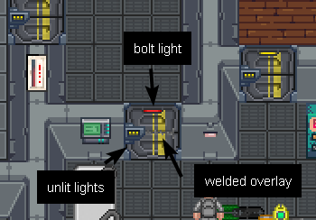
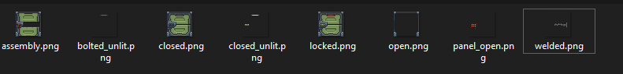

# Making a Sprite Dynamic

Most examples here will focus on **item cabinets**, such as fire extinguishers and fire axe compartments. They're very basic, but are complex enough that they require their own visualizer and understanding of sprite layers. The relevant classes here will be `ItemCabinetComponent`, `ItemCabinetSystem` (client and server-side versions), `ItemCabinetVisuals` (shared), and `ItemCabinetVisualsComponent`.

Let's posit a question: What's the most efficient way to update an entity's sprite? If the server sent the entire `SpriteComponent` state (a component used for rendering entities), that would be a lot to send to each client! Not to mention, it's not really the server's job to worry about how the entities are rendered. What if the server simply sent the basic 'appearance data' for an entity (is it opened, is it locked, is it powered, what color are its solutions, etc), and it was the client's job to reconstruct how it should look?

How do we accomplish this? With `AppearanceComponent` and `VisualizerSystem`s, of course!

## Appearance Data

In SS14, anything more complicated than a single unchanging sprite is rendered dynamically using appearance data. `Visualizers`, or `VisualizerSystem`s are purely client-side `EntitySystem`s that update an entity's sprite using appearance data. Visualizer systems usually have a corresponding client-side component which stores some adjustable parameters. For example, the client-side `ItemCabinetSystem` and `ItemCabinetVisualsComponent`.

Why do we do this? It was mentioned a little bit be fore, but a couple reasons:

- It's a lot less bandwidth to send some simple integers or strings over to the client than it is to send a whole sprite layer state.
- It offloads some important work to the client where possible, which is always nice.
- It decouples visualization of an entity from the code that operates on it.
- It allows us to, in the future, to allow for sane in-game photographs or replays. The reasons for this are a little complicated and I'm lazy so I'll write it later.

Data is sent and received using the `AppearanceComponent`, specifically the functions `TryGetData` (on the client) and `SetData` (on the server). The data is stored as a `Dictionary<object, object>`, meaning (mostly) anything can be used for the key and value. In practice, the key should always be an enum to allow for type checking that we don't get with strings, to avoid collisions with the key, and to make it very obvious what's happening. In fact, `TryGetData` and `SetData` only actually support enums and strings as the key.

### Example

Here's a really simple server-side setting of appearance data, in `ItemCabinetSystem`:

```csharp=
        private void UpdateAppearance(EntityUid uid,
            ItemCabinetComponent? cabinet = null,
            AppearanceComponent? appearance = null)
        {
            if (!Resolve(uid, ref cabinet, ref appearance, false))
                return;

            appearance.SetData(ItemCabinetVisuals.IsOpen, cabinet.Opened);
            appearance.SetData(ItemCabinetVisuals.ContainsItem, cabinet.CabinetSlot.HasItem);
        }
```

The key are enum values from `ItemCabinetVisuals`, to make it obvious what they're used for, and the data in both instances is a bool. `AppearanceComponent` and `AppearanceSystem` handle replicating this data to the client automatically!

---

Any client-side entity system can be a `VisualizerSystem`.

Let's look at the client-side `ItemCabinetSystem` to see how it retrieves and uses appearance data:

```csharp=
public sealed class ItemCabinetSystem : VisualizerSystem<ItemCabinetVisualsComponent>
{
    protected override void OnAppearanceChange(EntityUid uid, ItemCabinetVisualsComponent component, ref AppearanceChangeEvent args)
    {
        if (TryComp(uid, out SpriteComponent? sprite)
            && args.Component.TryGetData(ItemCabinetVisuals.IsOpen, out bool isOpen)
            && args.Component.TryGetData(ItemCabinetVisuals.ContainsItem, out bool contains))
        {
            var state = isOpen ? component.OpenState : component.ClosedState;
            sprite.LayerSetState(ItemCabinetVisualLayers.Door, state);
            sprite.LayerSetVisible(ItemCabinetVisualLayers.ContainsItem, contains);
        }
    }
}
```

First, visualizer systems are defined as an inheritor of the `VisualizerSystem<T>` class, where T is the relevant component that contains data for visuals. This isnt stricly necessary--you can do all of this with just a normal entity system--but it is convenient.

The visualizer overrides `OnAppearanceChange`, a method specific to visualizer systems which is called when appearance data changes on the client, and tries to retrieve the sprite component so it can modify it using the new data. 

Then, it uses `TryGetData` to retrieve the aforementioned item cabinet visuals. Then, it uses that data to modify the sprite of the item cabinet. Nice and simple!

Though, those sprite functions might be a little confusing at first.

### Addendum: Generic Visualizers

Instead of adding many separate visualier systems & components, it is often possible to just make a visualier more general by adding an extra yaml data-field. To this end, there is a `GenericVisualizerSystem` & component, which replaces the older `GenericEnumVisualizer`. If all you need the visualizer to do is to set some sprite layer data based on simple appearance data entries, you very likely can, and should, just use the generic visualizer instead of creating your own custom one. However, if you need to do fancy things like use animations or have more complex logic, you will still need to create your own.

For example, the functionality of the above cabinet visualizer simply sets a sprite layer states & visibility based on two appearance data entries. Instead of having this system & component, the same functionality could be achieved by using the generic visualizer:
```yaml
     - type: Appearance
     - type: GenericVisualizer
       visuals:
         enum.ItemCabinetVisuals.IsOpen: # <- Appearance data key. Either an enum or a general string.
           enum.ItemCabinetVisualLayers.Door: # <- sprite layer key. Either an enum or a general string.
            True: # <- Appearance data value
              state: open # <- Sprite layer data that should be used for this appearance value
            False: { state: closed } # <- You can also inline yaml, which can reduce indentation and improve readability.
         # and then again for the other appearance entry:
         enum.ItemCabinetVisuals.ContainsItem:
           enum.ItemCabinetVisualLayers.ContainsItem:
             True: { visible: true}
             False: { visible: false}
```
The sprite sprite layer data can set the `sprite`, `state`, `texture`, `shader`, `scale`, `rotation`, `offset`, `visible` and `color`.
Note that the yaml for the appearance values are simply the `ToString()` results of a the appearance data values.
So `bool`s become "True"/"False", while an enum like `VentPumpState.Off` just becomes "Off".


## Sprites, Layers and States

Entities in Robust require a `SpriteComponent` if they wish to have visuals. Sprite components can be modified clientside in many ways, as seen above, such as by setting visiblity, color (yes, dynamically colored!), or offset.

Sprites can just be one `state` (image), sure, but that's boring. A lot of sprites in SS14 need or want layers to represent some more complicated sprites without wasting space. It's recommended for even sprites with only one image to use layers, to make it easy to extend in the future. Any sprite operations can also be performed on individual layers.

### Example

Doors have a couple different overlays: 



If you didn't use layering, you would need a sprite for a door with nothing on it, a sprite with an unbolted door, a sprite with a bolted door, a sprite with a bolted door that's welded... All separate. Obviously, that's stupid as hell, so we just represent each overlay with a different image.



(note: oversimplified; this is not every sprite in this rsi)

---

Here is what the base airlock sprite component looks like:

```yaml=
  - type: Sprite
    sprite: Structures/Doors/Airlocks/Standard/basic.rsi
    layers:
    - state: closed
      map: ["enum.DoorVisualLayers.Base"]
    - state: closed_unlit
      shader: unshaded
      map: ["enum.DoorVisualLayers.BaseUnlit"]
    - state: welded
      map: ["enum.DoorVisualLayers.BaseWelded"]
    - state: bolted_unlit
      shader: unshaded
      map: ["enum.DoorVisualLayers.BaseBolted"]
    - state: emergency_unlit
      map: ["enum.DoorVisualLayers.BaseEmergencyAccess"]
      shader: unshaded
    - state: panel_open
      map: ["enum.WiresVisualLayers.MaintenancePanel"]
```

The `netsync` field is a bool which defines whether server-side operations will modify the sprite for every client. If you've coded your visualizer properly (or don't need a visualizer at all), this should be `false`!

The `sprite` field on a sprite component defines which RSI to draw states from.

The `layers` field is a sequence containing data for each sprite layer. It defines the state, as well as a couple other things.

In Robust, sprite layers can be 'shaded' or 'unshaded'. 'Shaded' means they're affected by lighting, and might change dramatically depending on the lighting around it. 'Unshaded' simply means they are unaffected by lighting or shadows cast, meaning they appear above shadows--giving the illusion that they're casting their own light. They still appear below FoV, though. 

Layers can be mapped to enum keys. This means that any sprite operations (set visible, set color, set state, etc..) can be performed with this enum as a key rather than the layer number (an integer). You'll note that this is exactly what the item cabinet system mentioned previously was doing, with its `ItemCabinetVisualLayers`.

## Animations

TODO