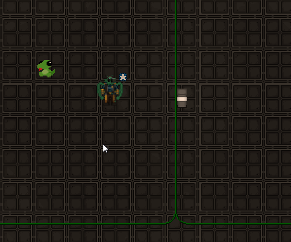
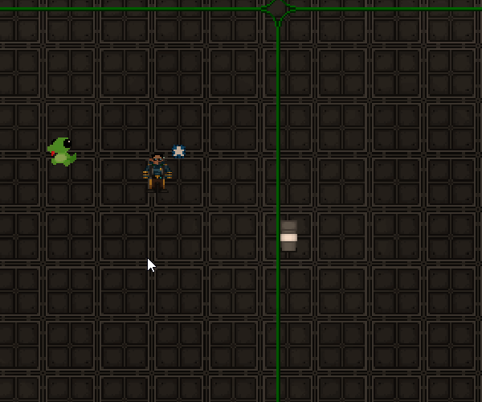
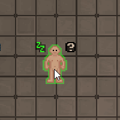

# Guide to Prediction

Client-side prediction is a network programming technique used to hide the effects of networking latency. For an introductory explanation of the general concepts as they are used in most modern multiplayer games I recommend watching these two videos:

[How a Software Feature Changed Online Gaming Forever](https://www.youtube.com/watch?v=hibDAXaHhnY)

[Why You Freeze In Counter Strike (netcode analysis)](https://www.youtube.com/watch?v=WfxD_NwNVO4)

In short, prediction allows your client to react to your inputs directly without having to wait for the server to acknowledge them first, which makes the game feel much more responsive, especially for players with high ping. If you directly compare a game feature in SS14 with and without prediction this will be a very noticeable difference.

For the upstream repository we require all new code to be predicted if it is possible (some systems like atmos and power cannot be predicted and are exceptions). A lot of old code is still unpredicted and cleaning that up is an ongoing effort, you can find an overview of the remaining systems [here](https://github.com/space-wizards/space-station-14/issues/40655).

See [this guide](basic-networking-and-you.md) for basic information on how to network components, which will be required knowledge for this tutorial. 

## How does prediction work?

Without prediction any input from the client (like keyboard presses or mouse clicks) will be networked to the server, which then simulates the game according to all players' inputs and networks the resulting game state back to each client. The client will only see the results with a noticable delay depending on their ping, which makes the game feel unresponsive and will cause a visual delay for UI elements.

With prediction each client runs its own simulation of the game according to the local player's inputs and they will immediately see the results without having to wait for the server, hiding any latency. The server holds the authoritative game state, which is what all clients consider to be the "truth" in case they disagree on something.

During prediction the client will repeatedly time travel. When the client receives a server state, due to latency that game state will belong to a game tick that lies in the past from the client's perspective. Therefore the client has to rewind its own game state to that point in the past, apply the information send by the server and resimulate the game from there while reapplying the player's inputs while doing so until it reaches the present game tick again. This will overwrite and correct any disagreements the client may have in their predicted simulation (for example someone else killed you while you tried to interact with something, but you did not know about that yet due to latency, so the interaction is canceled).

To reduce the network load the server usually does not send the full game state, but only the changes between each game tick (unless the client is freshly connecting or has major lag spikes).

Keep in mind that each client can only predict their own inputs and their results, as those of other players will still need to be networked to you first.

## Prediction Checklist
Most of the steps explained above are automatically handled by the game engine for any systems in `Content.Shared`, but you will have to make sure to network your code correctly.
Follow these steps to make an existing unpredicted `EntitySystem` predicted:
- Move the relevant components and systems from `Content.Server` to `Content.Shared`.
- Add the `NetworkedComponent` and `AutoGenerateComponentState` attributes to the components, and the `AutoNetworkedField` attribute to the datafields that the client needs to know about and that may change after spawning (if they never change from the value in the prototype there is no need to network them) or use manual component states if needed.
- `EntitySystem`s should either be a single non-abstract system in `Content.Shared`, or an abstract shared system with both the server and client inheriting from it if either of those rely on unique, non-shared code. Even if the client system is empty, make sure it exists or the code won't run on the client and will not be predicted.
- To be able to make some code predicted, all its dependencies need to be made predicted first, since shared code cannot call server-side code in a predicted way.
- Dirty the component every time its datafields are changed. This will tell the server to send all networked datafields in that component to the client so they get synced, and it will tell the client to reset that datafield to an earlier value during prediction.
- For larger components with lots of networked datafields or in cases where some datafields are changed at very different rates than others you should be using field deltas (use `DirtyField` for that) to reduce the network load. This will only dirty that datafield instead of the entire component.
- Use predicted API methods, for example `PopupPredicted`/`PopupClient`, `PlayPredicted` (for audio), `PredictedSpawnAtPosition`/`PredictedSpawnAttachedTo`, `PredictedDeleteEntity` and so on. If you don't use the right popup method, then you will see the popup show up about 10 times or not at all.
- Make sure that randomness is predicted as explained further below.
- Test everything in-game to see if it works as intended.

#### Testing tools for prediction
First try out everything to see if there are any visual glitches, flickering sprites, doubled audio, repeated popups or similar mispredicts. Make sure to also test with two client windows open at the same time to check if they both agree on what they see and everything is correctly networked to the second client if the first one interacts with something.

You can use the `sudo cvar net.fakelagmin 0.5` command to increase the fake lag in dev mode. If prediction works you won't notice the time delay from that. By default this already has a non-zero value, but increasing the lag makes any mispredicts much more visible.

I also find it helpful to open a `ViewVariables` window for the relevant component on both the server and client, set them to refresh automatically by right-clicking on the refresh button and then compare the values of the datafields as you are interacting with the entity. You can use the `quickinspect` command to quickly open both a server and client window for a component of your choice for an entity without having to search through the component list.
If everything works then the client's values will change instantly the moment you interact, and the server will update shortly after to the same values. If the client has to correct itself somehow or jumps between multiple values that is a misprediction.

#### Help, my code on the client is running multiple times for some reason!

When setting breakpoints or printing to the console you will notice that the predicted code runs 10+ times on the client. This is perfectly normal and just prediction at work. The client rewinds the game state to a previous tick each time it receives a server state and has to resimulate the game from there. However, this needs special treatment for things like UI or audio to prevent it from flickering or playing multiple times. This is explained in further detail below.

## Prediction Code example
Let's look at a simple unpredicted example component and predict it.

```csharp
// In Content.Server/PredictionExample/PredictionExampleComponent.cs

using Robust.Shared.Audio;

namespace Content.Server.PredictionExample;

/// <summary>
/// A simple test component that
/// - plays a sound and shows a popup when interacted with, either by activating it or by using a verb
/// - has an examination text
/// </summary>
[RegisterComponent]
public sealed partial class PredictionExampleComponent : Component
{
    /// <summary>
    /// How often the entity has been interacted with.
    /// </summary>
    [DataField]
    public int Counter = 0;

    /// <summary>
    /// The sound to play when interacted with.
    /// </summary>
    [DataField]
    public SoundSpecifier Sound = new SoundPathSpecifier("/Audio/Machines/machine_switch.ogg");
}
```

```csharp
// In Content.Server/PredictionExample/PredictionExampleSystem.cs

using Content.Shared.Examine;
using Content.Shared.Interaction;
using Content.Shared.Popups;
using Content.Shared.Verbs;
using Robust.Shared.Audio.Systems;

namespace Content.Server.PredictionExample;

// This system is server-side and therefore not predicted yet.
public sealed class PredictionExampleSystem : EntitySystem
{
    [Dependency] private readonly SharedAudioSystem _audio = default!;
    [Dependency] private readonly SharedPopupSystem _popup = default!;

    public override void Initialize()
    {
        base.Initialize();

        SubscribeLocalEvent<PredictionExampleComponent, GetVerbsEvent<Verb>>(OnGetVerb);
        SubscribeLocalEvent<PredictionExampleComponent, ActivateInWorldEvent>(OnActivate);
        SubscribeLocalEvent<PredictionExampleComponent, ExaminedEvent>(OnExamine);
    }

    // A simple right click verb
    private void OnGetVerb(Entity<PredictionExampleComponent> ent, ref GetVerbsEvent<Verb> args)
    {
        args.Verbs.Add(new()
        {
            Text = "Interaction Verb", // This should be localized, but I'm skipping that for this example.
            Act = () => Interact(ent),
        });
    }

    // Event that is raised when clicking on an entity or using it in your hand.
    private void OnActivate(Entity<PredictionExampleComponent> ent, ref ActivateInWorldEvent args)
    {
        Interact(ent);
    }

    // Increments an integer datafield, shows a popup and plays a sound.
    public void Interact(Entity<PredictionExampleComponent> ent)
    {
        // Increment the counter.
        ent.Comp.Counter++;

        // Play a sound at the location of the entity.
        _audio.PlayPvs(ent.Comp.Sound, ent.Owner);

        // Show a popup over the entity.
        // This should be localized, but I'm skipping that for this example.
        _popup.PopupEntity($"Interacted {ent.Comp.Counter} times.", ent.Owner);
    }

    // Show the counter in the examine text.
    public void OnExamine(Entity<PredictionExampleComponent> ent, ref ExaminedEvent args)
    {
        // This should be localized, but I'm skipping that for this example.
        args.PushMarkup($"Interacted {ent.Comp.Counter} times.");
    }
}
```
```yaml
# in Resources/Prototypes/test.yml
- type: entity
  parent: BaseItem
  id: ExampleItem
  name: Prediction Example Item
  components:
  - type: Sprite
    sprite: Objects/Fun/Plushies/lizard.rsi
    state: icon
  - type: PredictionExample
```


If we look at this in-game we notice the verb, examination text, popup and sound are happenening with a delay to our actual mouse click.



Now let's move the code to shared and network and predict it.

```csharp
// In Content.Shared/PredictionExample/PredictionExampleComponent.cs

using Robust.Shared.Audio;
using Robust.Shared.GameStates;

namespace Content.Shared.PredictionExample;

/// <summary>
/// We add NetworkedComponent so that the component itself is networked
/// and AutoGenerateComponentState to enable autonetworking for its datafields.
/// </summary>
[RegisterComponent, NetworkedComponent, AutoGenerateComponentState]
public sealed partial class PredictionExampleComponent : Component
{
    /// <summary>
    /// We add AutoNetworkedField to mark this datafield to be networked when we dirty the component.
    /// </summary>
    [DataField, AutoNetworkedField]
    public int Counter = 0;

    /// <summary>
    /// This datafield does not need to be networked, as it never changes after the entity is spawned.
    /// </summary>
    [DataField]
    public SoundSpecifier Sound = new SoundPathSpecifier("/Audio/Machines/machine_switch.ogg");
}

```
```csharp
// In Content.Shared/PredictionExample/PredictionExampleSystem.cs

using Content.Shared.Examine;
using Content.Shared.Interaction;
using Content.Shared.Popups;
using Content.Shared.Verbs;
using Robust.Shared.Audio.Systems;

namespace Content.Shared.PredictionExample;

// Now this system is predicted.
// No need to make it abstract and inherit it on the server and client
// because we don't have server or client exclusive code in this example.
public sealed class PredictionExampleSystem : EntitySystem
{
    [Dependency] private readonly SharedAudioSystem _audio = default!;
    [Dependency] private readonly SharedPopupSystem _popup = default!;

    public override void Initialize()
    {
        base.Initialize();

        SubscribeLocalEvent<PredictionExampleComponent, GetVerbsEvent<Verb>>(OnGetVerb);
        SubscribeLocalEvent<PredictionExampleComponent, ActivateInWorldEvent>(OnActivate);
        SubscribeLocalEvent<PredictionExampleComponent, ExaminedEvent>(OnExamine);
    }

    // The same subscription as before, just in Content.Shared.
    private void OnGetVerb(Entity<PredictionExampleComponent> ent, ref GetVerbsEvent<Verb> args)
    {
        var user = args.User; // We need to save this as a variable since we cannot use ref parameters inside lambda expressions.
        args.Verbs.Add(new()
        {
            Text = "Interaction Verb",
            Act = () => Interact(ent, user),
        });
    }

    // The same subscription as before, just in Content.Shared.
    private void OnActivate(Entity<PredictionExampleComponent> ent, ref ActivateInWorldEvent args)
    {
        Interact(ent, args.User);
    }

    // We now need to pass in the user so we can predict the popup and audio.
    public void Interact(Entity<PredictionExampleComponent> ent, EntityUid user)
    {
        // Increment the counter.
        ent.Comp.Counter++;

        // Dirty the component since we changed one of its datafields.
        // It does not matter where exactly we put this as long as it happens in the same game tick.
        // I like calling it directly below to make sure I don't forget doing so.
        Dirty(ent);

        // Use PlayPredicted instead of PlayPvs and pass in the client that predicted the interaction.
        _audio.PlayPredicted(ent.Comp.Sound, ent.Owner, user);

        // Use PopupPredicted instead of PopupEntity and pass in the client that predicted the interaction.
        // This popup will be visible to everyone. If you want to show it only to the user then use PopupClient instead.
        _popup.PopupPredicted($"Interacted {ent.Comp.Counter} times.", ent.Owner, user);
    }

    // The same subscription as before, just in Content.Shared.
    public void OnExamine(Entity<PredictionExampleComponent> ent, ref ExaminedEvent args)
    {
        args.PushMarkup($"Interacted {ent.Comp.Counter} times.");
    }
}
```
The result is much more responsive without the delay for the popup, audio or UI elements.



## Dependencies

Shared code can only call other shared code, whereas server-side code can use both server-side and shared code. This means if you want to predict an EntitySystem you will need predict all its dependencies first so that you can use them in Shared, which often turns prediction PRs into much larger tasks than initially expected.

Some systems cannot be predicted, but you might still want to call some API methods that are only available on the server from Shared. To work around this you can add an empty virtual API method in the corresponding shared system and override it on the server. Here's an example from [`SharedExplosionSystem`](https://github.com/space-wizards/space-station-14/blob/master/Content.Shared/Explosion/EntitySystems/SharedExplosionSystem.cs):
```csharp
// In Content.Shared/Explosion/EntitySystems/SharedExplosionSystem.cs
// This method is empty and does nothing on the client.
public virtual void TriggerExplosive(EntityUid uid, ExplosiveComponent? explosive = null, bool delete = true, float? totalIntensity = null, float? radius = null, EntityUid? user = null)
{
}

// In Content.Server/Explosion/EntitySystems/ExplosionSystem.cs
// This contains the actual code and only runs on the server, but can still be called from shared, since shared code runs on both the server and client.
public override void TriggerExplosive(EntityUid uid, ExplosiveComponent? explosive = null, bool delete = true, float? totalIntensity = null, float? radius = null, EntityUid? user = null)
{
    // Some code in here that creates the explosion
}
```

## PopupPredicted & PlayPredicted

Using `SharedPopupSystem.PopupEntity` in predicted code will cause the popup to be shown multiple times during prediction. Instead you have to use `PopupPredicted`, which will predict the popup once for the client passed in via the `user` parameter and the server will network the popup to everyone else, excluding that client so that they won't see the popup twice.
The other popup variants `PopopCursor` and `PopupCoordinates` will have to be replaced with their predicted variants respectively. `PopupClient` works like `PopupEntity` and shows the popup above the given entity, but only for a single client that predicts the interaction.

The audio API works in exactly the same way `SharedAudioSystem.PlayEntity`. You will have to use `PlayPredicted` and pass in a user to prevent the client from playing a sound multiple times.

These APIs come with a few limitations:
- You will always have to know the user, which is the entity the local player session is currently attached to, so you need to pass it along into every method where you want to play audio or show a popup.
- You cannot predict audio and popups in update loops as they do not have a single user available, but get predicted for all clients.
- You cannot predict audio and popups in container event subscriptions for events like `EntInsertedIntoContainerMessage` as they do not tell you the user that caused the event to be raised.
- You cannot run shared code using predicted popups or audio from the server in a non-predicted way, as the server will still assume that the user will have already predicted the popup or sound, meaning they won't see or hear it at all.

Ideally these two APIs will be reworked in the future to let the client automatically reconcile with the server state so that passing in the user is no longer needed and prediction is handled automatically.

## Predicted Entity Spawning and Deletion
[`IEntityManager`](https://github.com/space-wizards/RobustToolbox/blob/master/Robust.Shared/GameObjects/IEntityManager.cs) has a few methods for predicted entity spawning and deletion. Inside `EntitySystem`s they also have shorthands, see [`EntitySystem.Proxy.cs`](https://github.com/space-wizards/RobustToolbox/blob/master/Robust.Shared/GameObjects/EntitySystem.Proxy.cs).

#### Spawning
`Spawn`, `SpawnAttachedTo`, `SpawnAtPosition` can be used to spawn either client- or server-side entities. An example use case for client-side entities are the sprite previews in the spawn menu or guidebook, or for some visual effects. If you call these methods in shared code, both the client and server will spawn an entity separately, the server will network its entity to the client, which ends up with two different entities, one of them a duplicate that only exists for them and won't disappear. Instead you should use the `PredictedSpawnAttachedTo` and `PredictedSpawnAtPosition` (`Spawn` does not have a predicted equivalent). This will spawn both a separate client- and server-side entity, and the client-side one will be deleted when the server state comes in and the server-side entity replaces it.

This comes with some limitations as with the current implementation the predictively spawned entity is not reconciled with the server game state. For example the client-side entity cannot be interacted with and animated sprites will reset when the entity is replaced, causing visual glitches.

This will need further engine changes in the future, see [Entity spawn prediction v2](https://github.com/space-wizards/RobustToolbox/issues/5845).

#### Deleting
If you try to use `DeleteEntity` or `QueueDeleteEntity` to let the client delete a non-client-side entity it will cause an error:
`[ERRO] root: Predicting the deletion of a networked entity`.

If you want to predict entity deletion use the equivalent `PredictedDeleteEntity` or `PredictedQueueDeleteEntity` instead. These will let the client move the entity to nullspace first, which makes it seem to disappear. The server deletes it normally and then networks the deletion to the client.

## IGameTiming.IsFirstTimePredicted
This returns `true` the first time the code runs , and false in all the following prediction ticks while the client is waiting on the server. On the server this always returns `true` (the server does not predict anything, so it only needs to run the code once anyway). This is usually used internally in the form of a guard statement inside API methods for popups, audio and for some UI code to prevent it from running multiple times or flickering during prediction.

This is not a magic bullet to resolve any mispredicts! It is only intended for audiovisual information shown to the player, and most API methods already have this included where needed. So if you have a mispredict make sure to fix it properly and check if you are using the correct predicted API method variants like `PlayPredicted` and that your components are dirtied whenever you change their datafields.

`IsFirstTimePredicted` is currently [misused all across the codebase](https://github.com/space-wizards/space-station-14/issues/41116) to hide mispredicts, so don't trust existing code on this. This does not fix the underlying problem but rather disables prediction.

## IGameTiming.ApplyingState
This returns `true` while the client rewinds its own game state to that of of a received server state belonging to a previous game tick, so that any differences between them can be corrected. This is commonly used in the form of a guard statement to allow server states to be applied properly and prevent code from running when it should not.

To understand why this is needed you have to know that some events are networked along with a components state and are always raised on both the server and client even if not predicted and they are only using `RaiseLocalEvent` and `SubscribeLocalEvent`.

To give an example for container events like `EntInsertedIntoContainerMessage`, there are two scenarios:

A) The insertion of the entity into the container is predicted and the event is raised locally on both the server and client. The server networks the new gamestate to the client, the client finds that there are no differences as the container change was already predicted and does not need to correct anything. While predicting the insertion the client will rapidly raise both `EntInsertedIntoContainerMessage` and `EntRemovedFromContainerMessage` as it rewinds and reapplies the player inputs until the server state that acknowledges them comes in.

B) The insertion of the entity into the container is not predicted (for example if another player caused it), meaning the event is first only raised the server with a local event. The server then sends the new game state to the client, which applies it. While doing so the client will insert the entity into the client-side container, and `EntInsertedIntoContainerMessage` is raised once client-side.

This is done that way to allow a client to update UIs even if they did not predict the event, for example the storage window of your backpack, your hand indicator or the damage overlay, but it also may cause problems during subscriptions as any changes done inside them are already networked separately within the same game state, meaning they will be applied multiple times, causing mispredicts.

Let's look at an example from `GlueSystem`
```csharp
// GluedComponent will make an item temporarily unremovable if you pick it up.
private void OnHandPickUp(Entity<GluedComponent> entity, ref GotEquippedHandEvent args)
{
    // When your client predicts picking up an item, due to the game state being repeatedly reset and your input being reapplied
    // the item will be rapidly inserted and dropped from your hand (about 10 times each) during prediction. 
    // This will raise both GotEquippedHandEvent and GotUnequippedHandEvent in alternating order.
    // Similarly when you predict dropping a glued item prediction will reinsert the item into the hand when rerolling the state to a previous one.
    // So dropping the item would add UnremoveableComponent on the client without this guard statement,
    // preventing the client from picking it up again, which would cause mispredicts.
    // However, adding and removing the UnremovableComponent and setting the datafields is already applied with the same game state,
    // so we don't have to do anything in that case, fixing the problem.
    if (_timing.ApplyingState)
        return;

    var comp = EnsureComp<UnremoveableComponent>(entity);
    comp.DeleteOnDrop = false;
    entity.Comp.Until = _timing.CurTime + entity.Comp.Duration;
    Dirty(entity.Owner, comp);
    Dirty(entity);
}
```

There is currently no consistent indication or naming scheme to show which events are behaving this way, so you will have to check yourself to see where the events you are subscribing to are raised and if you may need a `ApplyingState` guard statement.

The most common ones are
`EntInsertedIntoContainerMessage`
`EntGotInsertedIntoContainerMessage`
`EntRemovedFromContainerMessage`
`EntGotRemovedFromContainerMessage`
`ContainerIsInsertingAttemptEvent`
`ContainerGettingInsertedAttemptEvent`
`ContainerIsRemovingAttemptEvent`
`ContainerGettingRemovedAttemptEvent`
`DamageChangedEvent`
`HandCountChangedEvent`
`GotEquippedEvent`
`GotEquippedHandEvent`
`GotUnequippedEvent`
`GotUnequippedHandEvent`
`DroppedEvent`
`SolutionChangedEvent`
`SolutionContainerChangedEvent`

## Predicted update loop example
A lot of old code is accumulating frametime inside update loops to decide when to next run it.
```csharp
/// <summary>
/// Unpredicted example.
/// </summary>
[RegisterComponent]
public sealed partial class UpdateLoopExampleComponent : Component
{
    /// <summary>
    /// How much time has passed since the last update?
    /// In seconds.
    /// </summary>
    [DataField]
    public float Accumulator = 0f;

    /// <summary>
    /// The time interval for the update loop (we don't want to run it every single tick for performance reasons).
    /// In seconds.
    /// </summary>
    [DataField]
    public float UpdateInterval = 1f;
}

public sealed class UpdateLoopExampleSystem : EntitySystem
{
    public override void Update(float frameTime)
    {
        // Loop over all components, ignoring paused entities.
        var query = EntityQueryEnumerator<UpdateLoopExampleComponent>();
        while (query.MoveNext(out var uid, out var comp))
        {
            comp.Accumulator += frameTime;

            if (comp.Accumulator < UpdateInterval)
                continue; // Not enough time has passed since the last update.
        
            // Reset the accumulator.
            comp.Accumulator -= UpdateInterval;
        
            // Do stuff here.
        }
    }
}
```
This is bad for prediction, as dirtying the accumulator datafield every single tick would be expensive due to the network load if we repeatedly have to send game state updates from the server. So instead of accumulating frame time we use a time stamp indicating when the next update is supposed to happen and compare that with the current server time.

```csharp
/// <summary>
/// Predicted example.
/// We need to network the component for this.
/// </summary>
[RegisterComponent, NetworkedComponent]
[AutoGenerateComponentState, AutoGenerateComponentPause]
public sealed partial class UpdateLoopExampleComponent : Component
{
    /// <summary>
    /// The server time at which the next update will happen.
    /// We use AutoPausedField so that this is automatically incremented if the server is paused and unpaused again.
    /// Otherwise all update loops would instantly fire when unpausing.
    /// We use the TimeOffsetSerializer to let this datafield be serialized relative to the current server time.
    /// This is important for persistance and without it you would get different results depending on when you load a game save.
    /// This datafield needs to be networked so that the server and client will be able to update simultaneously.
    /// </summary>
    [DataField(customTypeSerializer: typeof(TimeOffsetSerializer))]
    [AutoNetworkedField, AutoPausedField]
    public TimeSpan NextUpdate = TimeSpan.Zero;

    /// <summary>
    /// The time interval for the update loop (we don't want to run it every single tick for performance reasons).
    /// Does not need to be networked since this value remains constant in this example.
    /// </summary>
    [DataField]
    public TimeSpan UpdateInterval = TimeSpan.FromSeconds(1);
}

public sealed class UpdateLoopExampleSystem : EntitySystem
{
    [Dependency] private readonly IGameTiming _timing = default!;

    public override void Initialize()
    {
        SubscribeLocalEvent<UpdateLoopExampleComponent, MapInitEvent>(OnMapInit)
    }
    
    private void OnMapInit(Entity<UpdateLoopExampleComponent> ent, ref MapInitEvent args)
    {
        // Set the first update time after the entity is spawned.
        // Without this it would update every single tick until NextUpdate catches up with the server time.
        ent.Comp.NextUpdate = _timing.CurTime + ent.Comp.UpdateInterval;
        Dirty(ent);
    }

    public override void Update(float frameTime)
    {
        // CurTime is calculated so we do it only once outside the update loop instead of for every sigle entity.
        var curTime = _timing.Curtime;
        // Loop over all components, ignoring paused entities.
        var query = EntityQueryEnumerator<UpdateLoopExampleComponent>();
        while (query.MoveNext(out var uid, out var comp))
        {
            if (comp.NextUpdate < curTime)
                continue; // Not enough time has passed since the last update.
        
            // Set the time for the next update.
            // Don't use
            // comp.NextUpdate = curTime + UpdateInterval;
            // because that eats the remainder with every update, causing the update loop to run slightly less often
            // than given by UpdateInterval, which will be imprecise and can cause problems over large time durations.
            comp.NextUpdate += UpdateInterval;
        
            // Dirty the component so that the client can reroll the NextUpdate datafield during predcition.
            // Without this you will get mispredicts.
            Dirty(uid, comp);
        
            // Do stuff here.
        }
    }
}
```

If your component has multiple networked datafields consider using field deltas to prevent the update loop from networking all of them with each update.

## PVS
To reduce the networking load on the server it will only network any entities within a certain range (by default a 25x25 square around the client's attached entity). If an entity leaves PVS range then it will be paused so that update loops will no longer run on the client and detached into nullspace on the client until it reenters PVS range.

If you want to see this in action you can fly around as an aghost while having the view zoomed out.


Since the server holds the authoritative game state, it always has full knowledge about all entities, but the client will be restricted on what information it has available, which has implications for prediction. The client won't be able to predict anything happening outside of PVS range, and some code like atmos or power cannot be predicted as a result.

#### Nullspace
Nullspace is an empty default map where entities are spawned if you don't specify any spawn location. It is commonly used for entities that represent "abstract" data - things that need to be tracked but don't really have a physical location.

Examples for entities that live in nullspace are antagonist objectives and mind and mind role entities, which hold information about a player's antag status. Since they are on a different map than the player those entities are not networked to them. This ensures that cheaters are not able to read other players' antag status. A player receives a PVS override for their own mind entity, meaning their client can see it even though it's on another map. This makes it possible to predict interactions that depend on your own mind (for example only ninjas can plant ninja spider charges), but not interactions that require information about other players' minds.

#### PVS overrides
If you want to network or predict something that is outside PVS range you will need a PVS override. Use these sparingly, as they add extra networking load.

- `AddSessionOverride`: Makes a specific entity always visible to a given player until the override is removed again. An example use case is the wizard's recall ability, which teleports a far away entity that has been previously marked back into your hand.
- `AddGlobalOverride`: Makes this entity always visible to all players, independent of PVS. An example is the singularity, which has this due to the large range of its distortion overlay effect, where you would see it pop into PVS range without the override.
- `AddViewSubscriber`: Allows a player to see all entities within PVS range of the given entity until unsubscribed. An example use case are cameras, which allow the player to watch far away locations through a second viewport.

## Session specific networking
By default all clients will receive full information about all networked components and their datafields within PVS range. While they cannot read all this information without being an admin and using the ViewVariables window, some cheaters may still use this to obtain otherwise hidden information that is available on their client, for example antagonist status or if someone has contraband in their inventory. So be careful with the information you network for prediction purposes and if necessary use the following tools to restrict it to only those clients that need to know.

#### SendOnlyToOwner
All components have the `SendOnlyToOwner` bool, which will cause the component to only be networked to a player if they are attached to the entity the component belongs to. This is useful for some traitor abilities or traits that only the user needs to know about. An example is `PacifiedComponent`, which makes you unable to attack others, but other players don't need to know about it for prediction purposes since they cannot predict the keyboard input from the pacified player (the server needs to send it to them first).

#### SessionSpecific
All components have the `SessionSpecific` bool, which will cause a `ComponentGetStateAttemptEvent` to be raised on the owning entity for each player the component is being networked to and allows you to cancel the networking in a subscription. Note that this comes with some performance overhead since it may raise a lot of events.
An example for this is [`SharedRevolutionarySystem`](https://github.com/space-wizards/space-station-14/blob/master/Content.Shared/Revolutionary/SharedRevolutionarySystem.cs) which uses this to let only revolutionary players and admins know who else is a revolutionary. However, the API for this is currently quite annoying to use and requires a lot of boilerplate code. Maybe in the future this could be simplified into a component whitelist to decide who can see a certain session specific component. 

## Predicted Randomness
If you use `RobustRandom` in shared code the server and client will roll different random results, causing mispredicts. Even worse, the client will also generate a different result for each prediction tick. This often happens for random spawning, randomized sprite colors, random locations or similar.

Here is an example of a mispredict happening when gibbing someone, so that you know what to look out for. Note the organs jumping around wildly due to each prediction tick moving them to another random location.



In the future Robust Toolbox will have methods for predicted randomness, but at the time of writing the [PR for RandomPredicted](https://github.com/space-wizards/RobustToolbox/pull/5849) has not been merged yet.
As a workaround you can use a new `System.Random` instance and set the seed to something the server and client agree on, for example a combination of an entity's `NetEntity` id and the current game tick (if you would only use the game tick here then all randomness within the same game tick would yield the same result, so we need both). There is a helper method in `SharedRandomExtensions` that you can use for this.

```csharp
// EntitySystem dependencies:
// [Dependency] private readonly IGameTiming _timing = default!;
// [Dependency] private readonly IRobustRandom _random = default!;

// This will mispredict:
bool randomBool = _random.Prob(0.5f);
double randomDouble = _random.NextDouble();

// Instead use this:
bool randomBoolPredicted = SharedRandomExtensions.PredictedProb(_timing, 0.5f, GetNetEntity(uid)); // Helper method that directly gives you a bool.
var rand = SharedRandomExtensions.PredictedRandom(_timing, GetNetEntity(uid)); // Create a new System.Random instance that is the same on the server and client.
double randomDoublePredicted = rand.NextDouble(); // Create some random number from it.

// Same for any other method in IRobustRandom, since it is just a System.Random wrapper.
// If you generate multiple random numbers in the same tick for the same entity then you can re-use the System.Random instance instead of instantiating a new one for each call.
```

Be careful with this, since a cheater that knows the corresponding `NetEntity` id might in theory influence the result if they wait for the correct game tick to send the user input. So any game features that could give you a major advantage like random item spawning, telecrystal discounts in stores, antag or objective selection etc. should better stay unpredicted if the player is able to time them exactly.

## WeakEntityReference
According to the convention used in our ECS an `EntityUid` should always refer to a valid, existing entity. If you have an autonetworked datafield of type `EntityUid` the source generator will convert it into a `NetEntity`, send it to the client, and convert it back into the corresponding `EntityUid` on the client (which will have a different id than that of the server). To get the `NetEntity` the server will have to read the entity's `MetaDataComponent`. However, if the entity is deleted somehow (for example when being eaten by the singularity, recycled, gibbed or used for crafting) the component will be deleted along with it. This results in an error when the server is trying to network a component containing an `EntityUid` referencing a deleted entity:
```
Can't resolve "Robust.Shared.GameObjects.MetaDataComponent" on entity 957132/n0D!
   at System.Environment.get_StackTrace()
   at Robust.Shared.GameObjects.EntityManager.GetNetEntity(EntityUid uid, MetaDataComponent metadata) in /home/runner/work/space-station-14/space-station-14/RobustToolbox/Robust.Shared/GameObjects/EntityManager.Network.cs:line 186
...
```

To prevent this from happening you have to set the datafield back to `null` if the entity is deleted somehow, however this is tricky to keep track of, requiring marker components and a lot of boilerplate code.

At the time of writing the WizDen servers get more than 20000 of these errors each day and resolving them will require some engine changes introducing a `WeakEntityReference`, which references an entity that may or may not be deleted. Alternatively a relations system that will automatically set the referencing datafield back to `null` might be introduced. Once the engine PR is merged the content repository will require some cleanup to get rid of these errors.

See [this issue](https://github.com/space-wizards/RobustToolbox/issues/6152) for more details.

## NetSync

Each component inherits the `netsync` datafield from the base component class. Setting this to `false` will disable it from being networked, meaning that dirtying the component will do nothing.
This is useful if you want to allow clients to modify the datafields of a component without being overwritten by the server's gamestate or keep a component unpredicted on purpose.

## Predicting BUIs
`BoundUserInterfaces` usually send whatever information they need on the client using a `BoundUserInterfaceState`, which is similar to manual networking. But if we are already networking the relevant datafields then the client already has all this information available, and the BUI state is just duplicated networking. Instead we can completely remove the BUI state and just read the needed information directly from the component using a `TryComp` on the client. The userface can then be updated in an `AfterAutoHandleStateEvent` subscription (remember to activate it by setting the `raiseAfterAutoHandleState` parameter in the `AutoGenerateComponentStateAttribute`) so that it will be adjusted whenever a datafield in the relevant component is changed. If you need to update the BUI when an entity is inserted or removed from a container then you can do this with an `EntInsertedIntoContainerMessage` or `EntRemovedFromContainerMessage` subscription.

For sending messages about button presses and other user input from the UI from the client to the server you will have to use `SendPredictedMessage` instead of `SendMessage` so that the client will predict it.

To make sure the BUI is also updated during prediction and not only when receiving the server state you will also need an empty virtual `UpdateUi` method in your shared code that will call the BUI's `Update` method in a client-side override.

A good code example for predicting a BUI using component states can be found in [this PR](https://github.com/space-wizards/space-station-14/pull/33835).

## Things to watch out for
#### Performance tips

Dirtying and networking is expensive. Avoid dirtying entities every single tick from an update loop. Think about how to minimize the amount of data you have to send. For example in systems like [hunger](https://github.com/space-wizards/space-station-14/blob/master/Content.Shared/Nutrition/EntitySystems/HungerSystem.cs) or [battery charge](https://github.com/space-wizards/space-station-14/blob/master/Content.Shared/Power/EntitySystems/SharedBatterySystem.API.cs) do not network the new hunger or charge value repeatedly, but only send a value at a certain time stamp along with the current rate of change. That way the client can always infer the current value without requiring a new game state to be sent.

When setting a datafield it is recommended to add a guard statement to check if the datafield has a new value before calling `Dirty` so that we only network it when actually necessary.

```csharp
// inside an EntitySystem

public void SetExampleDataField(Entity<ExampleComponent?> ent, int newValue)
{
    if (!Resolve(ent, ref ent.Comp))
        return; // do nothing if the entity does not have the component
    
    if (ent.Comp.ExampleDataField == newValue)
        return; // nothing changed, no need to dirty
        
    // set the datafield and dirty the component
    ent.Comp.ExampleDataField = newValue;
    Dirty(ent);
}
```

It is recommended to give your components access restrictions using `[Access(typeof(SomeSystem))]` so that only the corresponding system can set its datafields using setter API methods like the example above. This makes sure that other systems can only modify the component in ways that are intended and that they cannot forget to dirty the component and a good API makes future changes to a component have less breaking changes.

#### Running predicted code from the server

Just because your code is in shared does not mean it will be predicted. If an event is only raised on the server then the client will not magically run any shared subscriptions, but only adjust the components once the server state comes in. So make sure the event you are subscribing to is also raised in a predicted way if you want your code to be predicted. Note that this is not always possible, for example for atmos code, which cannot be predicted.

In most cases it is recommended to define events and components in `Content.Shared` even if you only use them on the server. This makes it possible to use them for client-side entities and makes it easier in case someone wants to predict them in the future.

#### IRobustCloneable

Prediction repeatedly resets any dirtied datafield back to a previous game state and resimulates the player input. However, if your datafield is a [reference type](https://learn.microsoft.com/en-us/dotnet/csharp/language-reference/keywords/reference-types) it will only reset the reference to that datafield, not the datafield's current value. This can lead to [mispredicts](https://github.com/space-wizards/space-station-14/pull/34838) and even [major graphical glitches](https://github.com/space-wizards/space-station-14/issues/38512) if not handled correctly. To fix this make sure to implement the `IRobustCloneable` interface when using autonetworking with any custom reference type you are networking and the source generator will make sure to create a deep copy of the datafield for each game state. A code example for this is the [`Solution`](https://github.com/space-wizards/space-station-14/blob/master/Content.Shared/Chemistry/Components/Solution.cs) class used in the [`SolutionComponent`](https://github.com/space-wizards/space-station-14/blob/master/Content.Shared/Chemistry/Components/SolutionComponent.cs).

#### Conventions for shared systems and components
EntitySystems should either be non-abstract and shared, for example:
```csharp
// In Content.Shared/SomeNamespace/SomeSystem.cs
public sealed class SomeSystem : EntitySystem
{
    // ...
}

```
or have a shared abstract system that is inherited on the server and client.

```csharp
// In Content.Shared/SomeNamespace/SharedSomeSystem.cs
public abstract class SharedSomeSystem : EntitySystem
{
    // ...
}

// In Content.Server/SomeNamespace/SomeSystem.cs
public sealed class SomeSystem : SharedSomeSystem
{
    // ...
}

// In Content.Client/SomeNamespace/SomeSystem.cs
public sealed class SomeSystem : SharedSomeSystem
{
    // ...
}
```
Don't forget the client-side system, even if it's empty. Otherwise the client won't be able to instantiate the system and it will remain unpredicted.

Avoid shared abstract components. Some ancient code is still doing this, but nowadays we just instead put the entire component into `Content.Shared`, even if some datafields are only used on the server or client. This is minimally worse for performance, but makes the code much more readable, simplifies any API methods and makes it easier to use `TryComp` and `Resolve`.

#### The UdderSystem debug assert
There is currently some weird behaviour with solution entities and PVS, which may cause debug asserts under specific circumstances and will need a workaround, see [this PR](https://github.com/space-wizards/space-station-14/pull/35314). I'm mentioning this here because this is tricky to figure out otherwise.

This debug assert happens if a predicted update loops calls `SharedSolutionContainerSystem.ResolveSolution`, and the entity containing the solution entity leaves PVS range. This should not be happening since entities are paused when moved outside PVS range, meaning the update loop should no longer run on the client, but for some reason this still causes the debug assert and needs a workaround until this is fixed properly in a way that does not need this boilerplate code.

```csharp
private void OnEntRemoved(Entity<UdderComponent> entity, ref EntRemovedFromContainerMessage args)
{
    // Make sure the removed entity was our contained solution
    if (entity.Comp.Solution == null || args.Entity != entity.Comp.Solution.Value.Owner)
        return;

    // Cleared our cached reference to the solution entity
    entity.Comp.Solution = null;
}
```

This makes sure that the cached reference to the solution entity is reset to null as is leaves PVS range and is detached into nullspace.

See [this issue](https://github.com/space-wizards/space-station-14/issues/42218) for the current state of this problem.

#### Only use NetworkedComponentAttribute for shared components
Adding `[NetworkedComponent]` to a purely server- or client-side component (i.e. not in `Content.Shared`) does not make any sense since those cannot be networked in the first place.
However at the time of writing RobustToolbox is not preventing you from doing so and instead of creating a warning or error it will just break silently. The symptoms include random other components no longer being networked to the client, which will cause a huge range of bugs, for example mispredicts and UIs not being populated. So this is something you should keep an eye on during reviews or when writing new code.

See [this issue](https://github.com/space-wizards/RobustToolbox/issues/5194) for the current state of this problem.
