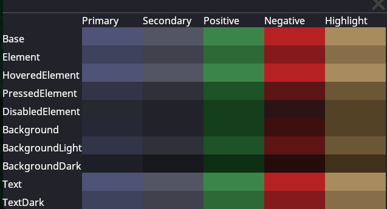

# UI and You

Or how I learned to stop worrying and love Sheetlets.

```admonish note
The UI system in SS14 has been through several iterations, and many portions of
the codebase are out-of-date with the current UI conventions. When using
existing UIs as reference, please keep the age of the code in mind.

If you find some code that is not up to the current conventions, refactors are
always appreciated!
```

Before learning how it should be done in SS14, it's important to understand how
the engine handles UI. You should reference the
[user interface documentation](../robust-toolbox/user-interface.md) first.

Read that? Great.

## Okay, but how do I make it fancy?

### `FancyWindow`

`DefaultWindow` is not recommended. Unless you're making your own custom window,
`FancyWindow` should be used in all circumstances. It has additional properties
that integrate with SS14 better than `DefaultWindow`.

The `Stylesheet` property allows a window to receive styling information from a
given stylesheet. We will talk about stylesheets in more depth later, but which
stylesheet a given UI is using determines which set of style rules are applied
to it. Currently, there are the following stylesheets:

- `Nanotrasen` - The default stylesheet. Used for any standard player-facing
  Uis
- `System` - Primarily used for admin and sandbox UIs
- `Syndicate` - Used for any UIs affiliated with the syndicate

### `StyleClass`

Style classes allow style rules to apply styling to an element. You can give an
element style classes by setting the `StyleClasses` property in XAML.

`Content.Client/Stylesheets/StyleClass.cs`: is a static class that for defining
style class strings that can apply to any UI element. This is to centralize the
location of all available style classes, for ease of access and prevention of
duplicate style classes.

Any style classes that are generic / can be used for more than one element are
defined at the top. For example, the style class `positive` affects `Button`,
`Panel`, and `Label`.

The rest of the style classes are defined for a specific generic UI element.
Some common style classes are as follows:

- `OpenLeft`: Makes the button flat on its left side
- `OpenRight`: Makes the button flat on its right side
- `OpenBoth`: Makes the button flat on both sides; square
- `LabelSubtext`: Makes the label smaller and a more muted color
- `LabelKeyText`: Makes the label bold and a highlight color
- `LabelWeak`: Weak is the opposite of strong; makes the label a more muted
  color

There are many more than this, but if you want to know exactly what a given
label does, its as simple as looking at the field's usages, and reading the
style rule definition.

```admonish tip
In general, if you are doing UI dev, I would recommend using the Rider IDE. It
eats up quite a bit of RAM, but it provides autocomplete in XAML files, a lot
of really nice auto-refactoring and searching features, and very decent git
integration. Give it a shot!

I don't think this is possible in VSCode though if you figure it out leave the
setup here.
```

## Writing Styles

This section concerns style rules. For most UIs, editing these will be
unnecessary, however you should ALWAYS prefer to use style classes instead of
hardcoding colors or resources that could be commonly used.

### All hail the mighty `Sheetlet`

It's important to understand that basically, a stylesheet is a massive list of
every single style rule. Instead of making one giant list of style rules
(because that would be ridiculous... haha... ha....), the responsibility of
chipping into this list is distributed between many Sheetlets. Each Sheetlet
returns a small chunk of style rules, which is agglomerated into the final list
at the end.

```admonish note
Previously every single style rule was in one giant list: `StyleNano.cs`, a 1600
line pit of despair where dreams went to die. It was so gargantuan that it broke
syntax highlighting in IDEs. Do NOT let anything like this happen again.
```

There are, primarily, two types of Sheetlets:

- **Generic Sheetlets**: These go in `Content.Client/Stylesheets/Sheetlets`.
  These sheetlets concern generic UI elements used in many different UIs, and
  should be written generically to work with any stylesheet.
- **Specific Sheetlets**: These go along with the `*.xaml` files they are
  associated with. These sheetlets concern UI elements that are specific to a
  single UI, and should be written to work with the specific sheetlets they
  are associated with.

This document will go into more detail about the specific conventions to follow
for both of these later.

All sheetlets should have the `[CommonSheetlet]` attribute.

```admonish tip
Do not forget the `[CommonSheetlet]` attribute.
```

### Style Rules

Style rules are what apply styling to XML elements, not unlike the ones found 
in CSS. They are composed of a selector, which specifies what elements this
style rule affects, and a set of properties that define the styling to apply
to those elements. First, lets look at selectors, which filter elements based on
a few different traits:

- `Type`: The type of element this rule affects. Anything inheriting from this
  type will also be affected by this rule.
- `StyleClasses`: The classes that the element must have to be affected by
  this rule. The element must have all of the classes specified by the rule to
  be affected by it. This is specified in the XML with the `StyleClasses` 
  property.
- `StyleIdentifier`: The identifier of the element. This is a unique
  identifier that can be used to target a specific element. This should be
  used when there is only one instance of the element that needs to
  be styled in a highly specific manner. An element may only have one 
  identifier, which is specified in the XML with the `StyleIdentifier` property.
- `PseudoClasses`: These are special classes that can be used to target
  elements in a specific state. For example, this is used to style buttons
  differently when hovered or pressed or whatever. These are triggered
  automatically through user interaction.
- Elements may also be styled based on their parent element, and all their
  style properties. In the style rule definition, this is done with the
  `.ParentOf(...)` method, which takes in another selector describing the 
  child element which the styles will be applied to.

Selectors that specify more of these filters are more "specific", and will take
priority over selectors that are less specific. If you want your style rule to
override others, make it more specific.

Any elements matching the selector will then have the properties defined in the
style rule applied to them. The properties are the same in both C# and XAML.

To assist with constructing these style rules, there are helper methods defined
in `Content.Client/Stylesheets/StylesheetHelpers`. To see this in action, let's
walk through some examples of style rules:

```cs
// you need this using statement to use the helper methods
using static Content.Client.Stylesheets.Redux.StylesheetHelpers;

var rules =
[
    // select any element...
    E()
        // ...with the class "negative"
        .Class(StyleClass.Negative)
        // ...and set its font color to the text color from the negative palette
        .FontColor(sheet.NegativePalette.Text),

    // select any `Label`...
    E<Label>()
        // ...with the class "LabelHeading"
        .Class(StyleClass.LabelHeading)
        // ...and set its font to a bold 16pt font
        .Font(sheet.BaseFont.GetFont(16, FontKind.Bold))
        // ...and its font color to the text color from the highlight palette
        .FontColor(sheet.HighlightPalette.Text)

    // select any `ContainerButton`...
     E<ContainerButton>()
        // ...with the class "button"
        .Class(ContainerButton.StyleClassButton)
        // ...and the class "ButtonSmall"
        .Class(StyleClass.ButtonSmall)
        // ...that is the parent of a `Label`,
        .ParentOf(E<Label>())
        // ...and set that `Label`'s font to an 8pt font
        .Font(sheet.BaseFont.GetFont(8))
];
```

Of course they are capable of much more. Read the sheetlets implemented in-game
to learn how something is done!

### Death to Hardcoding!

Whenever possible, avoid hardcoding in your style rule definitions to keep them
as reusable / broad as possible. The following systems are designed to help keep
all the definitions in a central location, and your style rules should be
patterns that apply those definitions.

#### `ColorPalette`

There is actually a pretty robust (haha) color palette system to hopefully make
hardcoding colors unnecessary. There are a set of common palettes defined in the
`Palettes` class, and each stylesheet uses these for the following common
palettes that sheetlets reference:

- `PrimaryPalette`: Used for foreground elements
- `SecondaryPalette`: Used for background elements
- `PositivePalette`: A traditionally green palette used to represent success /
  good / full
- `NegativePalette`: A traditionally red palette used to represent errors /
  bad / empty
- `HighlightPalette`: Used to highlight headings or important elements

In C#, you access the colors by accessing the properties on the `ColorPalette`
class. From brightest to darkest, the properties are (as of writing) arranged as
so (where lower numbers are darker):

- `+0`: `Text` `Base`
- `-1`: `TextDark`, `Element`
- `-2`: `BackgroundLight`, `PressedElement`
- `-3`: `Background`
- `-4`: `BackgroundDark`, `DisabledElement`

The reason why this approach is taken, rather than a simple array of colors, is
for readability. The colors in a palette have specific intended uses, so
representing that intention in your code is important to avoid mistakes and make
code cleaner and readable.

Here is a visualization of the colors used in `NanotrasenStylesheet`'s palette:



#### `ISheetletConfig`

`ISheetletConfig` is intended to cut down on repeated code by providing shared
functionality and definitions between the stylesheets. Any `Sheetlet` that
requires the values in some instance of `ISheetletConfig` should have a generic
type constraint that requires the `ISheetletConfig` interface.

```cs
[CommonSheetlet] // don't forget `[CommonSheetlet]`!
public sealed class ExampleSheetlet<T> : Sheetlet<T> where T : PalettedStylesheet, IExampleConfig
```

`ISheetletConfig` also serves as a dependency check. When the stylesheets pull
all the sheetlets that have `[CommonSheetlet]`, they will first check that they
satisfy the type constraint before adding the rules to the stylesheet.

```admonish info
A sheetlet failing to satisfy the type constraints of any stylesheet will cause
the game to log an error. If your styles are not showing up, this may be why.
```

#### Resource Access

Resources are accessed different in sheetlets compared to other parts of the
codebase. Each stylesheet provides a list of directories (roots) to use when a
resource is requested (For example, the `TextureResource` root in
`NanotrasenStylesheet` is `/Textures/Interface/Nano`). This means that any
texture requested with `GetTexture` will be searched for relative to this
directory.

### Generic Sheetlets

Generic sheetlets are used for common UI elements that are used throughout many
different UIs. These are grouped together in
`Content.Client/Stylesheets/Sheetlets`. Here are some conventions to follow when
writing generic sheetlets:

- You should always select elements with `.Class` and not `.Identifier`.
- When accessing resources, use the `GetTextureOr` method to get the texture
  and provide a fallback root to use if the texture is not found within the
  stylesheets roots.
- Avoid manual hardcoding of classes. When referencing classes, you should
  only use classes defined on the element being styled (in `StyleClass*`
  properties) or define your own in `StyleClass.cs`.
- If you need to access a resource that is not provided already, you should
  add the path to the relevant `ISheetletConfig` or create a new one entirely.

<details>
<summary>Example Code (click to expand)</summary>

```cs
using Content.Client.Stylesheets.Redux.SheetletConfigs;
using Content.Client.Stylesheets.Redux.Stylesheets;
using Robust.Client.UserInterface;
using Robust.Client.UserInterface.Controls;
// you need to add this line manually to access the helper methods
using static Content.Client.Stylesheets.Redux.StylesheetHelpers;

namespace Content.Client.Stylesheets.Sheetlets;

// MAKE SURE TO INCLUDE THE [CommonSheetlet] ATTRIBUTE
[CommonSheetlet]
// define the sheetlet and its dependencies
public sealed class CheckboxSheetlet<T> : Sheetlet<T> where T : PalettedStylesheet, ICheckboxConfig
{
    public override StyleRule[] GetRules(T sheet, object config)
    {
        // cast the sheet into any of its required dependencies here
        ICheckboxConfig checkboxCfg = sheet;

        // get any textures / construct any complicated resources here
        var uncheckedTex = sheet.GetTextureOr(checkboxCfg.CheckboxUncheckedPath, NanotrasenStylesheet.TextureRoot);
        var checkedTex = sheet.GetTextureOr(checkboxCfg.CheckboxCheckedPath, NanotrasenStylesheet.TextureRoot);

        // and finally, define all the style rules and return a big 'ol list of them
        return
        [
            E<TextureRect>()
                .Class(CheckBox.StyleClassCheckBox)
                .Prop(TextureRect.StylePropertyTexture, uncheckedTex),
            E<TextureRect>()
                .Class(CheckBox.StyleClassCheckBox)
                .Class(CheckBox.StyleClassCheckBoxChecked)
                .Prop(TextureRect.StylePropertyTexture, checkedTex),
            E<BoxContainer>()
                .Class(CheckBox.StyleClassCheckBox)
                .Prop(BoxContainer.StylePropertySeparation, 10),
        ];
    }
}
```

</details>

### Specific Sheetlets

Specific sheetlets are used in conjunction with UI elements that are used only a
few times, most often all in a single UI. These sheetlets are located in the
same directory as the `*.xaml` file they are associated with.

Generally, these sheetlets follow slightly different conventions compared to
generic sheetlets:

- You should prefer to select elements with `.Identifier` and not `.Class`.
- Any styles that COULD be used by another UI should be moved to a generic
  sheetlet.
- Hardcoding is more relaxed, you should still try and avoid it when possible,
  but hardcoding `StyleIdentifier`s is probably fine.
- If you REALLY need a specific resource and its not worth adding it to an
  `ISheetletConfig` you can access it through `ResCache` as normal.
- You don't need to do the generic type constraints thing since the sheetlet
  should be specific to a single UI, and thus a single stylesheet.

<details>
<summary>Example Code (click to expand)</summary>

```cs
using Content.Client.Resources;
using Content.Client.Stylesheets.Redux;
using Content.Client.Stylesheets.Redux.SheetletConfigs;
using Content.Client.Stylesheets.Redux.Stylesheets;
using Robust.Client.Graphics;
using Robust.Client.UserInterface;
using Robust.Client.UserInterface.Controls;
// you need to add this line manually to access the helper methods
using static Content.Client.Stylesheets.Redux.StylesheetHelpers;

namespace Content.Client.Paper.UI;

// MAKE SURE TO INCLUDE THE [CommonSheetlet] ATTRIBUTE
[CommonSheetlet]
// which stylesheet is this sheetlet for
public sealed class PaperSheetlet : Sheetlet<NanotrasenStylesheet>
{
    public override StyleRule[] GetRules(NanotrasenStylesheet sheet, object config)
    {
        // define any IConfigs you need here
        IWindowConfig windowCfg = sheet;

        // get any textures / construct any complicated resources here
        var paperBackground = ResCache.GetTexture("/Textures/Interface/Paper/paper_background_default.svg.96dpi.png")
            .IntoPatch(StyleBox.Margin.All, 16);
        var paperBox = new StyleBoxTexture
            { Texture = sheet.GetTexture(windowCfg.TransparentWindowBackgroundBorderedPath) };
        paperBox.SetPatchMargin(StyleBox.Margin.All, 2);

        // and finally, define all the style rules and return a big 'ol list of them
        return
        [
            E<PanelContainer>().Identifier("PaperContainer").Panel(paperBox),
            E<PanelContainer>()
                .Identifier("PaperDefaultBorder")
                .Prop(PanelContainer.StylePropertyPanel, paperBackground),
        ];
    }
}
```

</details>

## Making your own Stylesheet

```admonish note
Multiple stylesheets only recently became feasable with the introduction of the
Sheetlet system, so the full range of possibilities this allows has not been
explored. If stylesheets get used in interesting ways besides palette swaps,
please update this section!
```

Creating a new stylesheet is not as complicated as writing all the style rules.
With well written style rules and sheetlets, a new stylesheet is just defining
the common colors, definitions and resources shared by all the style rules. In
its simplest incarnation, a new stylesheet is just a new color palette!

New stylesheets should be created with the intention of communicating a
different context. For example, the non-diegetic context of the admin UIs being
communicated with `SystemStylesheet`, or the sinister context of syndicate UIs
being communicated with `SyndicateStylesheet`.

The colors for stylesheets are defined using the
[OKLAB color space](https://bottosson.github.io/posts/oklab/), a perceptually
uniform color space. When you choose new colors for your stylesheet, it may be
helpful to use an [OKLCH Color Picker](https://oklch.com) and modify an existing
color.

## Applying a Stylesheet to your UI

To apply a stylesheet to your UI, you just need to set the
`FancyWindow.Stylesheet` to the name of the stylesheet. If you only want your UI
to have one stylesheet this is enough. However, if you want your UI to have
different stylesheets depending on context, there is a standard idiomatic way to
achieve this.

### Example: Syndicate Uplink UI

The syndicate uplink UI actually uses a more general UI called `StoreMenu`, so
we take a look at that. First, we need to make sure that `StoreMenu` is using
`FancyWindow` and this won't work without it.

<details>
<summary>Example Code (click to expand)</summary>

```xml
<!-- StoreMenu.xaml-->
<controls:FancyWindow
    xmlns="https://spacestation14.io"
    xmlns:gfx="clr-namespace:Robust.Client.Graphics;assembly=Robust.Client"
    xmlns:controls="clr-namespace:Content.Client.UserInterface.Controls"
    Title="{Loc 'store-ui-default-title'}"
    MinSize="512 512"
    SetSize="512 512">

    <!-- ... -->

</controls:FancyWindow>
```

```cs
// StoreMenu.xaml.cs
public class StoreMenu : FancyWindow
{
    // ...
}
```

</details>

Now, it's important to understand a little bit about how UIs fit into ECS. Each
UI window is created by an entity. These entities are defined in prototype files.
In the case of `StoreMenu`, `Resources/Prototypes/Store/presets.yml`. To change
the stylesheet we can add a `StylesheetComponent`, attaching a little data to
tell us what stylesheet this UI should use.

```yml
# presets.yml
- type: entity
  id: StorePresetUplink
  abstract: true
  components:
      - type: Store
        # ...
      - type: Stylesheet # add this component to the entity prototype!
        stylesheet: Syndicate
```

Each of these entities also owns an instance of a `BoundUserInterface`. The
purpose of the `BoundUserInterface` is to interface with the server and manage
the lifecycle of the UI window. What's important to us is that the BUI
initializes and opens the UI window based on the components in the entity.
So, now that our entity has a `StylesheetComponent` attached to it, we can query
it and apply the stylesheet:

```cs
// StoreMenuBoundUserInterface.cs
public class StoreMenuBoundUserInterface : BoundUserInterface
{
    private StoreMenu _menu;

    protected override void Open() {
        base.Open();

        _menu = this.CreateWindow<StoreMenu>();
        if (EntMan.TryGetComponent<StylesheetComponent>(Owner, out var stylesheet))
        {
            _menu.Stylesheet = stylesheet.Stylesheet;
        }

        // ...
    }
}
```

Since this pattern is so common, there's a helper method on `FancyWindow` that
does it for you! (This is why we needed to ensure `StoreMenu` extended
`FancyWindow`)

```cs
// StoreMenuBoundUserInterface.cs
public class StoreMenuBoundUserInterface : BoundUserInterface
{
    private StoreMenu _menu;

    protected override void Open() {
        base.Open();

        _menu = this.CreateWindow<StoreMenu>();
        _menu.ApplyStylesheetFrom(Owner);

        // ...
    }
}
```

Congratulations! Now you've dynamically applied a stylesheet to your UI window.

## Writing C# for UI

> **TODO:** I don't feel confident enough in my knowledge to describe in detail
> what to do and what not to do. This is just a general overview for now and
> should be updated.
>
> Also this should probably be another page.

The best way to learn how to write UI code is to look at existing code. Some UIs
definitely do some terrible things you should never replicate, but there are
mountains of terrible code in SS14, so this is not abnormal. I cannot teach
familiarity with the internals of this game, but I can give a general overview.

Code you could reference:

- Robotics Console
- Reagent Dispenser
- BatteryMenu

There are a few different parts to any UI. say were working with a entity called
`MyThing`, which we wanted to show a UI for. Heres, generally, what the
structure would look like:

```yaml
Content.Server/MyThing/:
    - Systems/:
          - MyThingSystem.cs # Inherits from `SharedMyThingSystem.cs`
            # Takes the messages and makes changes in-world, and takes data from in-world to update the UI state.
Content.Shared/MyThing/:
    - Components/:
          - MyThingComponent.cs # Defines the component for the entity
    - Systems/:
          - SharedMyThingSystem.cs # Controls the appearance data and general shared logic
    - SharedMyThing.cs # Defines the messages that can be sent between server and client, and the UI state

Content.Client/MyThing/:
    - Ui/:
          - MyThingWindow.xaml # The main window, where the main structure of the UI is defined
          - MyThingWindow.xaml.cs # Defines behavior for `MyThingWindow.xaml`, reading in inputs and calling `Action`s
          - MyThingBoundUserInterface.cs # Interfaces with the server, sending messages and updating the UI state
    - Systems/:
          - MyThingSystem.cs # Inherits from `SharedMyThingSystem.cs`
            # Takes appearance data and makes in-world changes to reflect that
```

### Bound User Interfaces

> **TODO:** someone more familiar with BUIs than me should write about how to
> write good BUIs. I'll just stick the notes from `#codebase-changes` by Bard in
> the discord here for now:
>
> > Predicted BUIs are in:
>
> For networking data:
>
> Option 1 (Preferred). Move the BUI state to component states. Use an existing
> client system / make one to handle updating the BUI upon the state updating
> (use TryGetOpenUi) and upon calling Open in the BoundUserInterface. See
> JukeboxSystem for an example, e.g.
>
> ```cs
> private void OnJukeboxAfterState(Entity<JukeboxComponent> ent, ref AfterAutoHandleStateEvent args)
> {
>     if (!_uiSystem.TryGetOpenUi<JukeboxBoundUserInterface>(ent.Owner, JukeboxUiKey.Key, out var bui))
>         return;
>
>     bui.Reload();
> }
> ```
>
> Option 2. Have the BUI control be a dummy until the state comes in
>
> For UIs: Call TryOpenUi in shared where possible and the client should just
> handle it. Calling it from server will also still work similar to the old
> behavior.
>
> For messages: Use SendPredictedMessage where possible in BUIs. At some point
> this will likely become the default over SendMessage.
>
> Overall: Prefer to use the overloads that take in EntityUids instead of
> ICommonSession, this will make it easier to code NPCs who can interact with
> UIs in future.
>
> >
>
> - There's a helper under this.CreateWindow<TWindow>() for BUIs that handles
>   disposing + opening + close subscription for you.
> - There's a method OnProtoReload that gets called on BUIs so you can
>   override and handle it without having to manually subscribe on another
>   system.
> - I have added prototype reload support to some stuff.
> - I have cleaned up a lot of BUI code. Windows now just raise events and the
>   BUI itself handles message sending.
>
> Some notes for future:
>
> - You should spawn / delete control entities inside of EnteredTree and
>   ExitedTree rather than inside Dispose.
> - Controls should be able to be constructed with an empty constructor and
>   should not call BUI methods directly. This makes re-use significantly
>   easier.
> - All new controls must handle prototype reloading if applicable.
> - All new controls should prefer to use component states and not BUI states
>   where possible. These work better with prediction and are easier to use.
> - Controls should be able to handle components disappearing and not rely
>   upon GetComponent<T> everywhere as there are no guarantees the component
>   exists.
