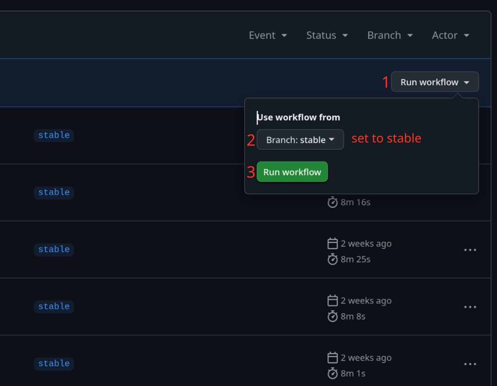

# Release Procedures (Proposal)

All times are in CEST/UTC+2
We can always just deviate from the established times below, if necessary. But having a particular time written down would help us know when we should consider some part of the process to be overdue and start asking about it

## Thursday 20:00 - Staging

### 0. Coordinate
Before you start, probably make sure no one else is already on it. Lead Maintainers usually do the staging and there is *typically* no need for anyone not frequently taking part in the setup process to get involved.

### 1. Update the staging branch
 Use the ```ss14-prepstaging``` function from [Myra's powershell script](https://gist.github.com/VasilisThePikachu/762b90187a5f9a0cca3249cc335cab31), which does most of it automatically (and also creates the Review Thread text for simplicity)

>If you need to do it manually:
>```
>git switch master
>git pull upstream master
>git rev-parse HEAD
>```
>Note down the displayed hash - the **newest** commit in the update
>
>```
>git switch staging
>git pull upstream staging
>git rev-parse HEAD
>```
>Note down the displayed hash - the **oldest** commit in the update
>
>```
>git merge master
>git push upstream staging
>```

Further merges into Staging should only happen if it's REALLY necessary, to ensure that we have time to review proposed changes and don't break things in the last moment. The process for this follows the [Hotfix Procedure](https://docs.spacestation14.com/en/wizden-staff/maintainer/hotfix-procedure.html). Revert or other changes may also be the result of a Maintainer vote after the meeting, this will be detailed below.

### 2. Hedgedoc
Copy [this template](https://hedgedoc.spacestation14.com/c5nwAvfqSIOIO5mcaNjy7w) and create a new doc for the current release

### 3. Make the new Release Review Thread in #maint-reviews
Review threads are currently on Discord, but may move to Discourse in the future.

If you used the script, it will automatically generate all the required text for you so you can just copy that and drop in the link to the new hedgedoc you made.

> Manual setup:
> * Title format: "YYYY-MM-DD Release Review Thread"
> * List the current commit range: <`oldest commit hash`> - <`newest commit hash`>
> * Link the current commit range: `https://github.com/space-wizards/space-station-14/compare/<oldest commit hash>...<newest commit hash>`
> * link the hedgedoc

Ping all Maintainers.

### 4. Add the list of Feature Changes to hedgedoc
Go through the commit range list and note every feature/balance PR in the current release. See the hedgedoc template for the format to be used.
> You can use [this script](https://discord.com/channels/310555209753690112/909229454449078333/1350070411571757086) to generate the correctly formatted string for each PR, but you need to pick out the PRs from the full commit list manually

If there are topically related PRs, reverts or hotfixes, it's nice to group those together. Otherwise the list can be in the order of the original commit list.
Smaller mapping changes to existing maps, PRs that only fix bugs without larger implications, or refactors and cleanups with no user-facing effects do not need to be listed.

This list should be double-checked for any feature change PRs that may be mistakenly left off. It's easy to miss something, and it's unreasonable to ask one person to spend excessive amounts of time double-checking it. It makes sense for at least one other person to check any remaining PRs if they should also be added. Anyone is free to review and add additional PRs to be listed but it's best do this right after the thread is opened, to reduce the possibility that late-added entries get skipped by early reviews. 

If you add new entries after people have already reviewed the list (as noted on hedgedoc), then mention the new PRs in the review thread.

## Until the Meeting - Reviews

### 1. Maintainers add any proposed meeting topics to hedgedoc

### 2. Maintainers review the feature changes 
Add any concerns/comments you have directly to the doc, you can also respond to other notes. Once you finished reviewing, add yourself to the "finished reviewing" list in the doc.

If something is unfinished/broken/etc enough that you think it should not be in the current release (in its current state), add a note starting with "BLOCK", followed by the concern or reasoning. You can further add what hotfix/conditions you think could salvage the PR in question for the current release, or if it should just be reverted outright.

#### The BLOCK tags

Using this unambiguous tag will help us have a smoother meeting and make the later vote/hotfix/revert process easier to decide.
If you do not mark your comment with BLOCK, we will still go over it during the meeting but it will be treated as a "non-binding" lesser concern/suggestion/idea/future feature, not something that demands a vote. (If you will be at the meeting, you will still be able to change this to a BLOCK then)

Two such objections are required for a PR to go to a revert vote, if someone adds a second one at this stage then we can see ahead of time that there will be a vote, and can maybe even figure out/address any concerns before the meeting. This helps everyone involved, so if at all possible, review and log BLOCKs early.

#### In Absentia

These comments also serve as the best way for people who can't make it to the meeting to engage with the revert process in a fair way. If you can't show up but have a concern, leave a BLOCK note along with your concern/reason/considtions, the meeting will not remove BLOCKs just because you are not there to argue for them. (Although if no one else seconds it before or during the meeting, then it will still not go to a vote)

## Saturday 20:00 - Maintainer Meeting

It would be nice if we all showed up on the clock, so we could start sooner. Ping 10 minutes before the meeting.

Historically, meetings have started with the Topics section. That will not be detailed in this doc. At some point, the meeting will get to the feature reviews.

### Feature Reviews, Revert votes
Go through any PRs that have comments. See if any notes need to be edited to become BLOCKing, if anyone seconds them, or if anyone changes their mind in some other way.
If at least two Maintainers have chosen to block a PR, there will be a vote after the meeting. Decide and document **now** what the vote options will be. The default option should be Revert, for simplicity. **Check the chat for any Maintainers not on voice trying to get a word in edgewise**. If the PR's author is present, consider consulting them.

Agree now who will start all the votes, both so the votes don't get forgotten and to force the future-votemaker to double-check if sufficient details about the votes have been noted down. (It sucks trying to figure out missing details by yourself after the fact)

### Hotfix votes
Optionally, some SIMPLE/straightforward change to the PR may be suggested. Such as tweaking numbers to something **specific** not just "it should do less damage", removing some specific, concrete part, or fixing a well-defined bug/issue. It should be discussed who will/might write this fix, not just hope that someone will start writing it afterwards. It does not need to be set in stone or a volunteer from the meeting, but we should have some idea at least.

Since unlike a revert, a hotfix can't be finished in moments, we have to consider the possibility that there will be a schedule slip. As such, for hotfixing to be considered an option, we will specify an acceptable delay. **If we are unwilling to risk such a delay for the feature, then we should simply vote for a revert instead**, and fix it by the next release. Recommended default delay is 24 hours after the original expected Release. (Note that the time chosen is the maximum, we might finish sooner. But we should be willing to accept the full length of the delay. Record the delay's end time in the meeting notes.

> All votes, whether for revert or hotfix, are RELEASE BLOCKERS. If some issue is minor enough that we could just release with it, then it might be better to just address it in the next release or hotfix it after release through the regular hotfix procedure.

### Evaluate active Feedback Pop-Up 
Feedback Pop-Ups is a feature that allows us to request players ingame to provide feedback for specific topics/PRs. As part of the meeting, go through the current active `FeedbackPopup` protoypes in `Resources/Prototypes/FeedbackPopup/feedbackpopups.yml` and evaluate which should be removed, remain on master, or provided to the stable servers. 

*No action is required* to have a pop-up remain only on the testing server, as the `PopupOrigin` property being set to `wizden_master` ensures it does not show on the stable servers. If a pop-up should be made visible on the stable servers, change the property to `wizden_master wizden_stable`. 

## Right after the Meeting
Votes are immediately started for blocked PRs. Open a Discourse thread for each vote in Internal/Maintainer. If multiple PRs are conceptually linked, and/or were contested "as one", they can be combined into one thread. Copy the summary about the situation from the meeting notes, for anyone who was not present at the Meeting. The recording might not yet be available for review before votes have to be cast.

Polls will be kept open until the official release time (roughly 24 hours later), so that every Maintainer can get their chance to vote. They must have only 2 outcomes, plus Abstain: such as Keep/Revert/Abstain, or Keep/Hotfix/Abstain. Abstain votes will not have any effect on the outcome, they merely serve to indicate that someone has seen the vote but is not participating. 
>Binary votes leave no requirement for interpretation when they finish, so we don't need to have the Maintainer team assembled for closing up the release. Whoever is there can enact the results, even if alone, with no special pressure or responsibility for making "the correct call", since it has already been determined by (the best available) consensus.

Afterwards, link the threads in #ongoing-votes and ping all maintainers.

## Sunday, before Release

The proposed hotfix(es) can be prepared before release, but no one should feel forced to code just so we don't have a delay. If we are voting on a hotfix then we have already accepted a potential delay. It's also possible that the vote will decide to keep the PR, making the fix/change unnecessary.

## 21:00 - The Official Release Time

The Maintainers present can begin. If necessary, coordinate in the Release Review Thread who's doing what. Close the votes and check the status of any other release blockers.

* If a vote's result is KEEP, the PR is no longer considered a blocker even if we want to later fix it.
* If a vote's result is REVERT, create a PR to revert the feature from Staging. This does not require multiple maint approvals - it already has them from the vote. Since we are reverting a feature from master, before it ever hit stable, remove it from the changelog as well
> Reverting a PR does not do this automatically, you need to edit changelog.yml directly. Note that you also can't add a new changelog on a hotfix PR through the normal process - they are only read from PRs on the master branch.
* If a vote's result is HOTFIX and the hotfix was already completed and approved, merge it now. Note that while the concept of the fix has been approved by the vote, it might still be a good idea to have multiple Maintainers look at it before merging, depending on complexity and ambiguity (although ideally there would be zero ambiguity). A delay was already accepted.
* If a vote's result is HOTFIX, and the hotfix is not yet completed or approved, we enter a Delay. This should be announced internally so everyone is aware, but no ping is required. Then go do whatever you want, it's sunday! Lizard will be fine.

In case of a tie, recount the Lead Maintainer votes only. If it's still a tie, take the more cautious option and consider the vote a REVERT or HOTFIX, whichever is applicable.

If no blockers remain, go to The Release.

## Delay
If the hotfixes could not be finished or tested in time, we enter a Delay. The expected maximum duration of the Delay has been agreed upon during the Maintainer meeting, and within this timeframe we should consider the delay acceptable enough not to be "concerned".

If the fix gets completed before the End Time, then any Maintainers present can start the release immediately, but they are also free to just note it and leave someone else to do it later within the accepted Delay.

Available Maintainers should reconvene at the End Time, to decide the continued fate of the blocking PR(s). At this point there will likely be Maintainer consensus established in some way, written decisions from the Lead Maintainers, or Lead Maintainers will be present, but if they aren't, then the Maintainers present decide whether to revert the PR in question or go into overtime waiting for the fix. There is no script for after going into overtime.

> Our level of priority for hitting release targets is currently in general unspecified

## The Release

### 1. Merge Staging into Stable

Do not create a PR.
Use either [Myra's script](https://gist.github.com/VasilisThePikachu/762b90187a5f9a0cca3249cc335cab31)
or plain git:

```
git checkout staging
git pull upstream staging
git checkout stable
git pull upstream stable
git merge staging
git push upstream stable
```

### 2. If there were any hotfixes on Staging that weren't already merged back, merge Stable into Master.

This needs to be done via PR on github (because the master branch is protected from pushing).
You can merge this PR by yourself immediately, but **DO NOT SQUASH IT**.

If there are merge conflicts at this step, note that you could publish stable before you get bogged down fixing the conflict for master so meanwhile the publish tests can run.

### 3. Run Publish

You can use github-cli to start publish, [Myra's script](https://gist.github.com/VasilisThePikachu/762b90187a5f9a0cca3249cc335cab31) already does this for you.

To do it manually, go to [github's web GUI](https://github.com/space-wizards/space-station-14/actions/workflows/publish.yml) and run the workflow with the stable branch:



### 4. Monitor if Salamander and Lizard actually deploy the new release after their next restart

Specifically these two servers sometimes restart for the patch, but don't actually get it due to "funny network reasons". If this happens, any Maintainer can run ```!updateserver servername``` on Discord to restart them again.
