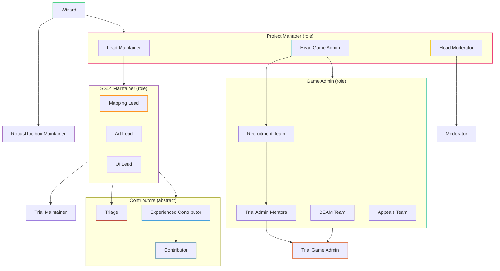

# Space Wizards Role Hierarchy

```mermaid
flowchart TD
    ExpContrib[Experienced Contributor]
    style ExpContrib stroke:#3498db
    Contrib[Contributor]
    style Contrib stroke:#6b9bb3

    Wizard[Wizard]
    style Wizard stroke:#2ecc71

    LeadMaint[Lead Maintainer]
    style LeadMaint stroke:#8237c4
    MaintMapper[Mapping Lead]
    style MaintMapper stroke:#ff8600
    MaintArt[Art Lead]
    style MaintArt stroke:#e1c4ff
    MaintUI[UI Lead]
    style MaintUI stroke:#e1c4ff
    MaintRT[RobustToolbox Maintainer]
    style MaintRT stroke:#9b59b6
    MaintTrial[Trial Maintainer]
    Triage[Triage]
    style Triage stroke:#b8372b

    AdminHead[Head Game Admin]
    style AdminHead stroke:#1abc9c
    AdminBeam[BEAM Team]
    AdminRecruitment[Recruitment Team]
    AdminMentor[Trial Admin Mentors]
    AdminAppeals[Appeals Team]
    AdminTrial[Trial Game Admin]
    style AdminTrial stroke:#e06e3d
    
    ModHead[Head Moderator]
    style ModHead stroke:#f1c40f
    Mod[Moderator]
    style Mod stroke:#f1c40f

    Wizard[Wizard] --> PM
    subgraph PM["Project Manager (role)"]
        AdminHead
        ModHead
        LeadMaint
    end
    style PM stroke:#e91e63
    subgraph MaintSS14["SS14 Maintainer (role)"]
        MaintMapper
        MaintArt
        MaintUI
    end
    style MaintSS14 stroke:#9b59b6
    subgraph Admin["Game Admin (role)"]
        AdminBeam
        AdminAppeals
        AdminRecruitment
        AdminMentor
    end
    style Admin stroke:#1abc9c
    subgraph NonStaffContribs["Contributors (abstract)"]
        Triage
        ExpContrib
        Contrib
    end
    

    AdminHead --> Admin
    AdminHead --> AdminRecruitment
    AdminMentor --> AdminTrial
    Admin --> AdminTrial
    AdminRecruitment --> AdminMentor

    ModHead --> Mod

    Wizard ---> MaintRT

    LeadMaint --> MaintSS14
    MaintSS14 --> MaintTrial
    MaintSS14 --> Triage
    MaintSS14 -.-> NonStaffContribs

    ExpContrib -.-> Contrib
```
