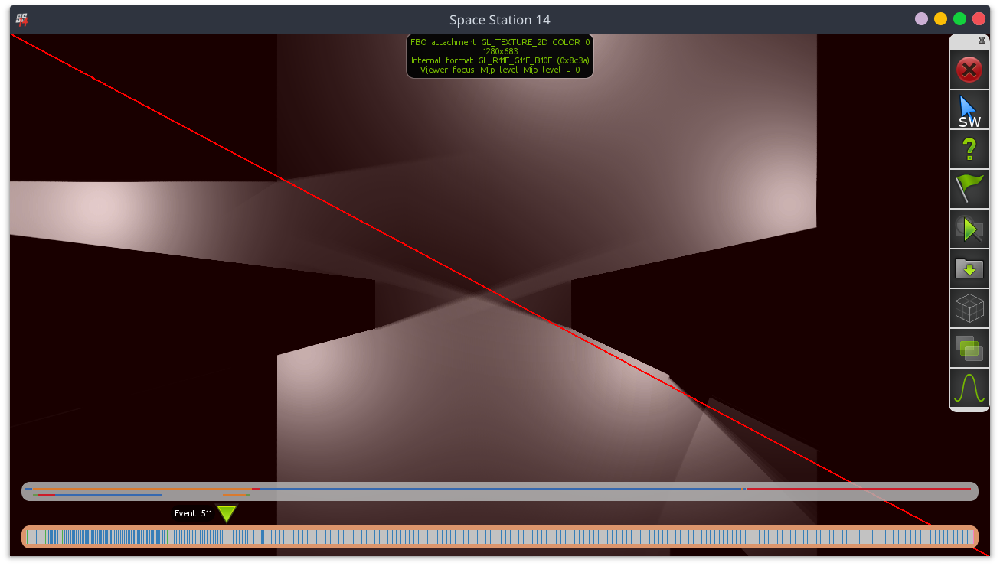

# Lighting & FOV

This file will document the current functioning of the lighting/FOV system, the awful issues with it, and ideas to improve it. Buckle up for a tale of mistakes and surrender.

I should note that this file is *not* a replacement for the in-code comments. Also please keep it up to date if you modify the code. This file is more a high-level overview of how the renderer works and the techniques used. Nitty gritty implementation stuff like culling is explained in-code.

Also don't expect any sort of good structure and not-bad-humor out of this document. Also don't think of me as a genius. I mention fancy terms like VSM down below. Don't think I understand the math behind VSM.

If you're feeling perticularly adventurous, many of the "failed experiment" things have some commit in the git history on [my branch](https://github.com/PJB3005/space-station-14/tree/20-02-10-shadows). So if you look at this and go "wow PJB the problem is obvious see" there's a good chance you can step to a commit with the problem to experiment.

## High level overview.

Here's a high level overview (wow, you read the title!) of the steps the renderer goes through.

1. Generate occlusion geometry.
2. Project depth for shadows & FOV.
3. Draw lights (with shadows applied) into light buffer.
4. Overlay FOV onto light buffer.
5. Blur out light buffer to "bleed into" walls.
6. (during regular map rendering) apply lighting from lighting buffer.
7. Apply FOV to final framebuffer.

## Depth casting.

To calculate shadows and FOV we first calculate the distance from the light / camera to the nearest occluder, continuously around it. Then while rendering the actual FOV/light we can check "is this pixel occluded" by figuring out the position in the shadow map and comparing the distance written in said shadow map with the value we calculate for distance from light/camera to pixel.

For each light/FOV source we draw geometry representing all visible occluders and store the distance values to a texture. The original version of this was based on 4 draw calls with different perspective projections, but the new version is based on polar coordinates, using 2 draw calls. The actual shadow map is a 1D "line", with each pixel representing a different angle, and the content of the pixel representing the depth, either 2-channel (GL3 floats, one channel for depth and one channel used by VSM) or 4-channel (GLES2 RGBA8, emulating the former).

As for why two draw calls are needed, the answer is that because the shadow map is literally circular, it's pretty much guaranteed that some faces may cross the edge. The vertex shader detects this by determining if the span of a face exceeds 180 degrees (obviously impossible with a straight line) and "generates" extra geometry by bumping the face edges left or right based on the pass.

Also note that perspective correction hardware DOES NOT WORK for circular rendering like this. First implementation had "bendy" shadow lines. As such, the fragment shader determines perspective correction manually with axis-aligned line/arbitrary ray intersection traces (basically `abs(lineStart.x / rayNormal.x)`: use X for vertical, Y for horizontal). As gl_FragDepth is not available on GLES2, the Z-values used for the internal depth buffer are still incorrect, but this never comes up in practice because the error is too slim to cause sorting issues and the colour buffer is used for actual shadow rendering.

Believe it or not, this is still cheaper and massively less complex than the per-fragment operations the 4-view sampler required. Sampling is now just a texture lookup.

It should be noted that light rendering stops immediately at all faces of the occlusion geometry. This means light does not "enter" walls. See the light bleed step above. FOV is slightly more complicated. FOV is actually calculated twice, once with back face culling and once with front face culling. This front-face culling is the final FOV drawn over the main game so that you can still see "onto" walls, but not behind walls. The back-face culled FOV is used for masking onto the light buffer.

We use some code to only insert back faces into the occlusion geometry in certain spots based on the position of the camera and surrounding occluders. This makes front-face culling suitable for rendering the final FOV pass without allowing you to see walls-behind-other-walls.

The idea of using 3D depth projection for calculating shadows in 2D has been taken from Godot.

### (Soft) Shadow Algorithms Are Hard

SS14 partially uses [Variance Shadow Maps (VSM)](https://developer.nvidia.com/gpugems/gpugems3/part-ii-light-and-shadows/chapter-8-summed-area-variance-shadow-maps) for some operations (namely, lights and lighting FOV). VSM is used because it "solves" shadow aliasing / biasing / acne issues. It is *not* used to implement soft shadows directly as suggested in the article.

I tried to implement soft shadows with VSM (by blurring the shadow map as suggested in the above article) and the results were that shadows would just clip around corners like mad. Maybe I messed something up, oh well. Either way, it wouldn't have nice distance based shadow softening that we have now (next paragraph) so I guess that worked out.

Soft shadows are a bit involved but I like how they look now. Basically we sample 7 points on an axis perpendicular to the light. These points are sampled at fixed distance apart. We then use them to calculate distance to the nearest occluder (by min'ing all the samples). Depending on this distance we can make the shadows softer if they are further away from an occluder, by changing the gaussian weights used for the samples. So, if the point is CLOSE to the occluder, the samples at the center will be weighted more strongly, and vice versa.

My attempts to run VSM after applying the gaussian weighting were, sadly, too wacky and did not work. Not that I expected them to.

VSM is not used for the final FOV (regular biased distance check is used instead, note that the lighting buffer FOV pass DOES use VSM) because it caused *severe* bleeding issues from the back of walls. Again, maybe I messed something up. 99% sure it was *not* the bleeding issue as described at `8.4.3` in the above article though (the fix they suggest did nothing). Here's the FOV bleeding in action. The blue stuff is bluespace and you should NOT be seeing it.

These bleeding issues might just be something VSM does that isn't a problem in 3D. It definitely is a problem in 2D however. Luckily due to wall bleed and such we don't notice the problem for regular lights and such. Maybe I'm an idiot and have no idea what I'm talking about, also an option.

Fun fact, the reason I was looking at VSM initially was because I couldn't get plain PCF to look acceptable. I know I messed up the shader code in my initial PCF tests so half the samples were duplicated. I only realized halfway through implementing VSM. Good job me!

## Light Rendering

As mentioned, all lights are rendered to an off-screen framebuffer first. **This frame buffer can change resolution depending on graphics settings, to significantly reduce load on lower end GPUs.** Lights are drawn with shadows immediately applied. Light rendering uses some exponential-but-not-quite-realistic-so-it-actually-has-an-end lighting function that looks quite alright. Shadow occlusion is applied, light mask is applied (for directional lights and such) and bam, let there be light.

This off-screen lighting framebuffer is a floating point framebuffer for HDR. HDR looks good.

FOV then gets applied to the lighting framebuffer. This means that any light in an area you can't see "doesn't exist". This will come in handy later. This is the back-face culled (or, less confusingly, not front-face culled FOV with VSM applied).

Lighting framebuffer after applying all lights.

Lighting framebuffer after applying FOV (center of window).

## Wall Bleed

If you've been paying attention (ok the images gave it away) you'll notice that the walls are not actually lit! Lighting up walls is done by running a multi-iteration gaussian blur over the lighting framebuffer. This blur *only* affects space that has an occluder over it. Floors and such are untouched.

Because FOV was applied to the lighting framebuffer before this, you won't see light on the other side of a wall! Truly dark maintenance tunnels!

This approach is partially taken from Unitystation. I should note that Unitystation actually *always* renders walls, even if they are behind multiple layers of other walls. You can't "see" those walls because they're pitch black due to the lack of nearby light (since light requires FOV). This however generates really funky FOV rays and also does not work correctly if walls emit light (like our airlocks do...). 

## World Rendering

Regular entity/world rendering has access to the lighting framebuffer. It samples from it to find the light on a point and blends with it in the default shader.

Stuff like APC lights literally just ignore the lighting framebuffer while rendering. Because 99.9% of real light scenarios are *darker* than "1" this makes them noticeably pop out.

## Final FOV Pass

We do a final FOV pass with the front-face culled FOV to block out anything remaining, like light bleeding onto occluded walls and lighting-ignoring machinery.

Because this pass uses regular depth casting... you can see stuff bleed through the back of walls at steep angles. Yep. Great. It's way less bad than the VSM attempt but it'd be EXTREMELY noticeable if the space background weren't as dim as it is.

We also do not render soft FOV edges. I couldn't get it to look good. Sorry.

## Performance

Performance is generally quite decent. The method used is cheap on both GPU & CPU, and a lot of current overhead can be cut out by just "improving the implementation". Some points:

The [original article that was referenced when implementing polar coordinates](https://www.gamasutra.com/blogs/RobWare/20180226/313491/Fast_2D_shadows_in_Unity_using_1D_shadow_mapping.php) only used one draw call, not two. The catch is, in order to deal with the wrapping problem, it complicated the per-fragment shader *even more*, requiring multiple shadow map samples. The answer to this tradeoff I (20kdc, responsible for implementing polar coordinates in SS14) took is documented above.

Rendering multiple lights in the same draw calls (by processing multiple lights in the same fragment shader run) should also be doable and would probably improve GPU performance significantly too (especially since it'd help reduce bandwidth use on the lighting framebuffer and all that).

Using purely the GPU to calculate depth, like we are doing, is *very* performant. It's how basically every 3D game works so... The biggest problem is that it's not very accurate, and inaccuracies look very jarring in 2D (biasing...)

NSight's performance tools seem to have stopped working for me and Intel GPA is a broken mess, so I can't verify this, but the gaussian blur for wall bleed might also be kinda costly on non-dedicated hardware.

## Bugs, Uglyness, And Potential Improvements.

"\[literally just] Where PJB admits that using 3D shadowcasting techniques in a 2D game is probably not a great idea in hind sight"

### Soft Shadows & Soft FOV

Soft FOV is completely unimplemented because I flat out could not get it to look decent, and I kinda gave up.

Soft shadows on lights look *meh* at best (at least by my standards). 

The advantage of 3D depth projection like we are using is that it's very cheap on the GPU and CPU. The disadvantage is that making it look *great* is... above my skill level, at the very least.

A better looking (but more expensive) approach would be to custom-generate occlusion geometry for every light source. This would require significantly more CPU effort. When doing this on the CPU we know exactly the distance from the light source and can generate decent-looking penumbras and such. (note from 20kdc: if antialiasing wasn't needed, a GPU vertex shader and use of the stencil buffer could probably get something performant going here, but it'd be much more of a separate technique and not as tunable as what's in place now.)

Strictly speaking, the front-face-culled FOV pass already makes use of such custom geometry (the shared occlusion geometry is made such that it works as usual without front face culling, but WITH front face culling it's designed around the camera center). This logic could be adapted to help here although it may not be perticularly optimal.

This approach would also basically solve all biasing and bleeding issues as mentioned above.

### More Performant / Accurate Wall Bleed Pass

I can't help but feel that using an inaccurate gaussian blur is not the best solution to the wall bleed issue.

Using custom occlusion geometry per light *might* make it possible to do some CPU-side calculations to not render onto walls if the light would be "on the other side of a wall" from the camera.

If such a pass could be implemented it would be way more accurate than the gaussian blur, and probably more performant on the GPU.

If you want an example of why the gaussian pass looks awful. Place some windows next to some walls. The window and walls actually have different brightness levels (the walls are forced to artifically create light energy in the blur pass to accomodate for the fact that they'd be half as bright otherwise). It does not look great, at *all*.

### Remove the awkward low-wall corners.

Currently there is the problem that transparent objects that are "part" of a wall still get shadows cast on them by their adjacent wall.

IDEALLY, the occlusion "triangle" here would be BENEATH the low wall tile and continue as normal behind it. This however is not trivial to implement at first sight but I think after a recent chat in Discord with Acruid we figured out a way.

After calculating regular depth, we do ANOTHER calculation pass, this time on low walls. This pass would have similar passing-through rules as the normal walls. The result of this pass is to calculate "closest low-wall exit after a hard occluder". We store this in another color channel.

Then, when rendering FOV, we let FOV pass *if* the occlusion point is before the "closest low-wall exit after a hard occluder". This way the exact tile of a low wall (because it's BEFORE the exit) won't have FOV, but ONLY if the occlusion started on this tile as well. If you have multiple layers of low walls (or shapes like t junctions, similar to regular walls) you wouldn't be before the closest exit.

We only have to do this for FOV as far as I can tell. Lights won't need this, and we can *probably* get away with doing wall-bleed-blur on the low wall itself instead with a mask or something.

## Links

- https://learnopengl.com/Advanced-Lighting/Shadows/Shadow-Mapping
- https://www.gamasutra.com/blogs/RobWare/20180226/313491/Fast_2D_shadows_in_Unity_using_1D_shadow_mapping.php
- https://developer.nvidia.com/gpugems/gpugems3/part-ii-light-and-shadows/chapter-8-summed-area-variance-shadow-maps
- https://github.com/PJB3005/space-station-14/tree/20-02-10-shadows