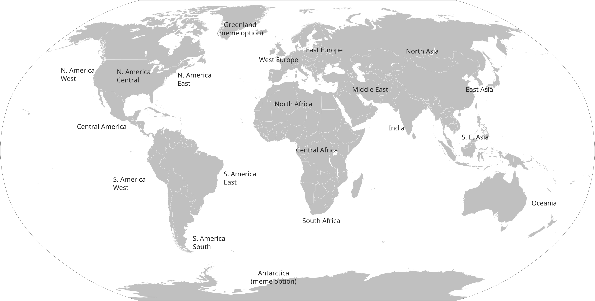

# Server HTTP API

The server has an embedded HTTP API for fetching status and sending commands remotely. This describes that API.

By default, this HTTP API listens on the same port number as the game UDP port, but this can be changed with the relevant `status.*` [CVars](../general-development/tips/config-file-reference.md). 

```admonish warning
This article uses comments in JSON to make stuff easier to describe. This is not standard JSON and just for example here. Don't put comments in JSON for real data.
```

Content can add more APIs to this.

## Public API (no authorization needed)

### `GET /status`

Gets basic status info about the server as JSON, used to display the status in the SS14 launcher. The engine automatically supplies the following info:

```json
// Note: comments are not valid in JSON normally, but it makes annotating stuff here easy.
{ 
    "name": "MyServer", // Server name
    "players": 5, // Amount of players on the server
    "soft_max_players": 10, // Optional, max player count on the server.
    "tags": ["rp:low"], // Optional, array of tags (see below for standard values)
}
```
Content can edit this info at will.

### `GET /info` 

More detailed JSON server information that is mostly necessary when connecting to the server (to download resources and some other stuff). 

```json
{
  	"connect_addrees": "", // udp:// URI that specifies UDP connection address. Automatically guessed to be same port as status API if left out.
    "auth": {
  			"mode": "Required", // Auth mode. Can be one of "Optional", "Required", "Disabled"
        "public_key": "", // Public encryption key of server to use when authenticating. This uses libsodium's "sealed box" API.
    },
    "build": { // Information about build to download. See below.
    },
    "desc": "My amazing server", // Optional, generic description for the server, shown in the fold in the launcher.
    "links": [ // Set of links to show in the launcher for this server.
        {
            "name": "Discord", // Name of the button shown in the launcher.
            "icon": "discord", // Icon to use for this button, can be left out. See below for valid icon names.
            "url": "https://discord.gg/abcdef" // Link this button opens when pressed. Must be http:// or https://
        }
    ]
}
```

For details about build information, see [Advanced Server Build Configuration](../general-development/setup/server-hosting-tutorial.md#server-build-configuration).

Content can also edit this at will.

## Watchdog API

Requires authorization by specifying the `WatchdogToken` HTTP header to match the `watchdog.token` CVar (automatically set when using the [watchdog](../server-hosting/setting-up-ss14-watchdog.md)).

### `POST /shutdown`

Instructs the server to gracefully shut down immediately.

### `POST /update`

Instructs the server that an update is available and that it should automatically shut down as soon as possible to allow for the update to be applied. For SS14, this means the server will restart when the current round ends.

## Info link icons

These are the valid icons for the `links` in the info API:
* `discord`
* `forum`
* `github`
* `web`: Generic website icon
* `wiki`

## Standard tags

These are standard understood tags for the `tags` field in status data. The launcher supports filtering and other behaviors based on these tags.

### `18+`

Your server contains 18+ content.

### `lang:`

Specifies Describes the language used on your server with an [IETF Language Tag](https://en.wikipedia.org/wiki/IETF_language_tag). Examples: `lang:en` for English, `lang:ru` for Russian, etc...

You can have multiple of this tag to specify multiple languages, if for some reason you want a multilingual server?

You can specify a more detailed IETF language tag like `en-US`, but the launcher will currently only look at the primary tag (e.g. `en`).

### `rp:none`, `rp:low`, `rp:med`, `rp:high`

Specifies level of RP (roleplay) expected on your server. This is very subjective.

### `region:`

Specifies a rough region code to aid players in selecting servers close to them. Following codes are understood:

| Code | Region |
|------|--------|
| `region:eu_w`   | West Europe |
| `region:eu_e`   | East Europe |
| `region:ata`    | Antarctica (meme option) |
| `region:grl`    | Greenland (meme option) |
| `region:am_n_w` | North America West |
| `region:am_n_c` | North America Central |
| `region:am_n_e` | North America East |
| `region:am_c`   | Central America |
| `region:am_s_s` | South America South |
| `region:am_s_e` | South America East |
| `region:am_s_w` | South America West |
| `region:af_n`   | North Africa |
| `region:af_c`   | Central Africa |
| `region:af_s`   | South Africa |
| `region:me`     | Middle East |
| `region:as_n`   | North Asia |
| `region:as_se`  | South East Asia |
| `region:as_e`   | East Asia |
| `region:ind`    | India |
| `region:oce`    | Oceania |
| `region:luna`   | The Moon (meme option) |

See this map for rough guidance what goes where:



If your region doesn't have a good fit, let us know!

### `no_tag_infer`

Stops automatic tag inference, see below.

## Tag inference

Some hub tags are automatically inferred by the launcher based on server name. This is mostly intended to provide some filters before all servers fill them in manually, so **if you're reading this as a server host, just fill in your tags manually and you can ignore this.** Rules are as follows:

* If you specify `no_tag_infer`, no tag inference is done at all.
* `[18+]` or `[+18]` automatically adds the 18+ tag.
* `[NRP/LRP/MRP/HRP]` automatically add the relevant roleplay level as a tag, if you have no explicit role-play tag at all.
* `[EN]` and `[RU]` add English and Russian as a tag respectively, if you have no explicit language tag at all.

**We will not be adding extra rules (e.g. detecting more languages) to this. Tag your server manually.**