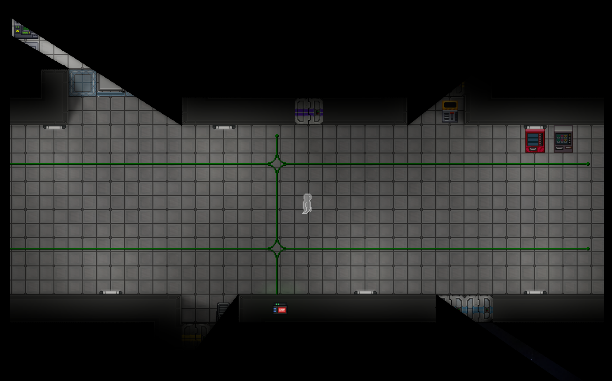
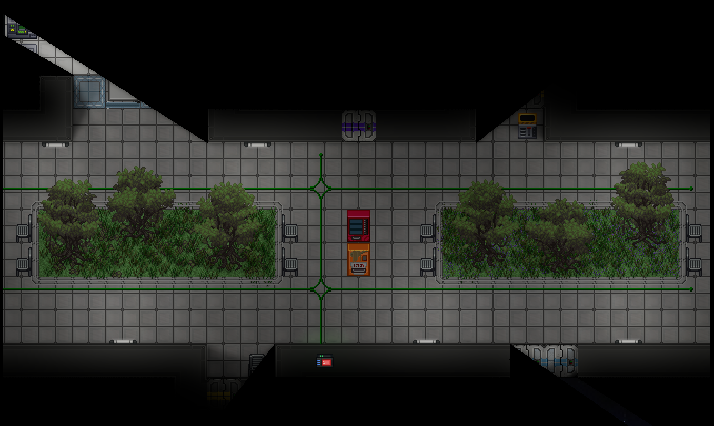
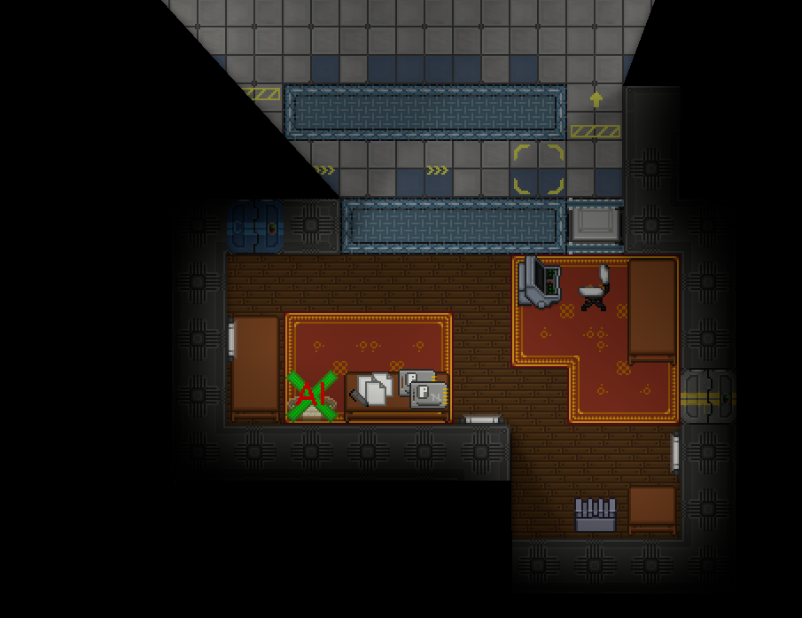

# Гріхи Мапінгу
Не робіть нічого з цього. Вони будуть виглядати/відчуватись погано.

## Ультрадовгі коридори
Отож, фішка у тому, що вони порожні.

Це виглядає і грається погано, з дуже великою кількістю візуального порожнього простору.

### Шляхи для вирішення

#### Перетворення на паркову доріжку
Заповнення візуальної порожнечі за допомогою рослинності, або інших декорацій значно допомагає. Але варто не переборщити, і краще просто створювати менші коридори.

## Надлишок срібних/золотих плиток
Вони плитки виглядають жахливо, особливо в поєднання з наклейками, і вони можуть використовуватись лише у дуже специфічних ситуаціях.

### Шляхи до вирішення

#### Просто змініть тематику
Якщо ви використовуєте їх для позначення кімнати з "багатим відчуттям", скажімо, офіс Голови Персоналу, замість цього зосередьтесь на домашніх відчуттях, з деревом і так далі. Більшість станцій просто не мають цього відчуття, і воно робить їхній вигляд винятковим.
